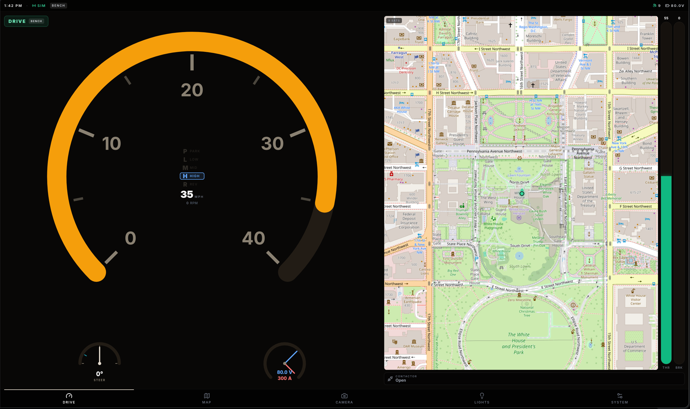

# gokart-dash — Raspberry Pi kiosk dashboard

React/Vite dashboard for the SMCS drive-by-wire kart. Runs fullscreen in
Chromium kiosk mode on the Raspberry Pi 4. Landscape; validated at 800×480 and
scales up.



```bash
npm install
npm run dev        # workstation dev (http://localhost:5173)
npm run build      # production bundle → dist/
npm run lint
```

## Architecture

- **`src/telemetry/`** — the single source of truth. `TelemetryProvider` holds
  one `Telemetry` object (`types.ts`) and drives it from exactly one source:
  - `live` — the 20 Hz WebSocket feed from the Pi bridge (see contract below),
  - `sim` — the operator-driven simulator on the **System** tab,
  - `none` — disconnected; everything reads unknown/zero (no fake values).

  There are **no mock/sample values** shown by default. A disconnected dash
  looks disconnected. Consume telemetry with `useTelemetry()`; the admin
  controls use `useTelemetryControl()`.

- **`src/notifications/`** — toast system. `useTelemetryNotifications` raises
  pop-ups automatically on meaningful transitions (precharge → contactor
  closed, arm/drive/stop, faults, wheel/steer-link, connection). `notify()` is
  available anywhere for one-offs.

- **Views** (`src/components/`): **Drive** (40 mph speed dial with the
  P/L/M/H/R gear stack in the center, minimap + throttle/brake bars sharing the
  right, contactor status), **Map** (full interactive OSM), **Lights**,
  **System** (source selector + simulator + diagnostics), **Camera**
  (placeholder). Tabs live in the bottom dock.

## Telemetry WebSocket contract (high-speed path)

The dashboard connects to **`ws://<pi-host>:5174/telemetry`** and expects
compact JSON text frames at ~20 Hz. This is the machine path the Pi bridge
(`kartd`, evolving `pi/teensy_bridge.py` — see
`docs/SOFTWARE-STACK-PLAN.md` §5.1) produces by parsing the Teensy binary
telemetry stream (`docs/protocols/uart-protocol.md`, TYPE `0x01`
`TELEMETRY_V1`) and merging the GPS/BMS readers into it.

The exact shape the client decodes lives in **`src/telemetry/wire.ts`**
(`WireFrame`). All fields are optional — a partial frame keeps the previous
value, so the bridge may send deltas. Field mapping from the binary frame:

```jsonc
{
  "type": "telemetry",        // optional; anything else is ignored here
  "t": 1234567,               // uptime_ms (uint32)
  "seq": 42,                  // rolling seq — lets the UI measure frame loss
  "state": "DRIVE",           // SAFE|ARMED|DRIVE|STOPPING|FAULT  (or index 0..4)
  "fault": 0,                 // fault_code (0 = none; see uart-protocol §3)
  "gear": "MED",              // LOW|MED|HIGH  (firmware open-loop gear model)
  "throttle": 55,             // throttle_pct 0..100 (post-slew, commanded)
  "brake": 0,                 // brake_pct 0..100 (pedal position)
  "speedMph": 21.3,           // hall-derived; BRIDGE computes from hall_hz_x10
  "steerSet": 4.2,            // steer_setpoint (deg)
  "steerMeas": 4.0,           // steer_measured (deg)
  "contactor": "CLOSED",      // OPEN|PRECHARGE|CLOSED|FAULT (optional; else
                              //   derived from flags.contactor + fault==8)
  "flags": {                  // from status_flags bitfield
    "wheel": true,            // bit0 WHEEL_CONNECTED
    "steerLink": true,        // bit1 STEER_LINK_OK
    "steerCal": true,         // bit2 STEER_CALIBRATED
    "escLink": false,         // bit3 ESC_LINK_OK
    "contactor": true,        // bit4 CONTACTOR_CLOSED
    "reverse": false,         // bit5 REVERSE
    "brake": false,           // bit6 BRAKE_ACTIVE
    "bench": true             // bit8 BENCH_MODE
  },
  "battV": null,              // batt_dv/10  (null until ESC/BMS telemetry lands)
  "battA": null,              // batt_da/10
  "escRpm": null,             // esc_rpm
  "ctrlTempC": null,          // controller_temp_c (−128 ⇒ send null)
  "motorTempC": null,         // motor_temp_c      (−128 ⇒ send null)
  "gps": {                    // merged from the NEO-M9N reader
    "fix": true, "lat": 38.8977, "lon": -77.0365,
    "heading": 120, "sats": 9, "speedKph": 34.0
  }
}
```

Notes for the bridge implementation:

- **Speed is bridge-side.** The firmware sends `hall_hz_x10`; convert to mph
  from pulses/rev and wheel diameter, then send `speedMph`. The dial is fixed
  at **40 mph** full-scale (`SPEED_MAX_MPH`).
- **`PRECHARGE`/`FAULT` contactor phases** aren't in the binary frame today.
  Emit `contactor` explicitly once the sequencer exposes precharge state (drives
  the "Precharging bus…" notification); until then the client derives
  OPEN/CLOSED/FAULT from `flags.contactor` and `fault==8`.
- The client reconnects automatically (1.5 s backoff) and marks the link down
  after 600 ms without a frame. No polling — one persistent socket.
- Until the bridge serves `/telemetry`, use the System tab's **Sim** source for
  development. The workstation has no kart, so `live` will simply show "No
  link".

## Lights

The Lights tab (`src/hooks/useLed.ts`) drives the LED strip through the bridge:

- **Solid presets** → `POST /api/led {r,g,b}` → `LED <r> <g> <b>`.
- **Rainbow** → `POST /api/led {effect:"rainbow"}` → `LED RAINBOW`. This is a
  **single fire-and-forget command**: the Teensy owns the animation, the dash
  never streams colors. (Brightness applies to solid colors only.)
