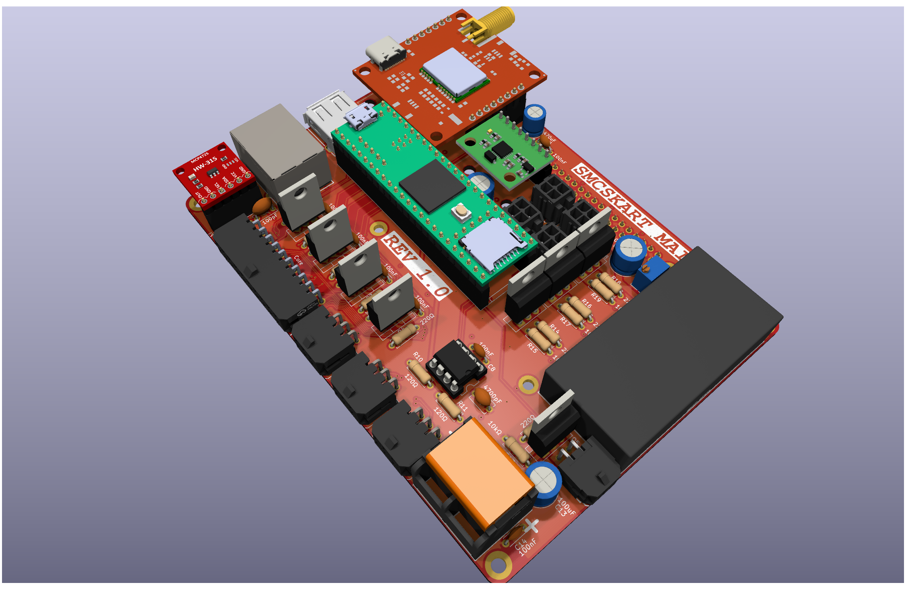
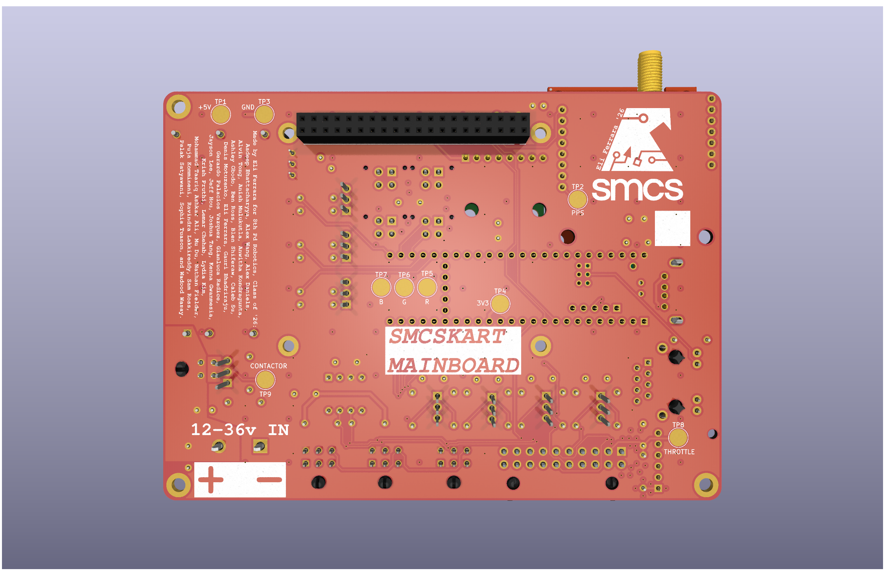
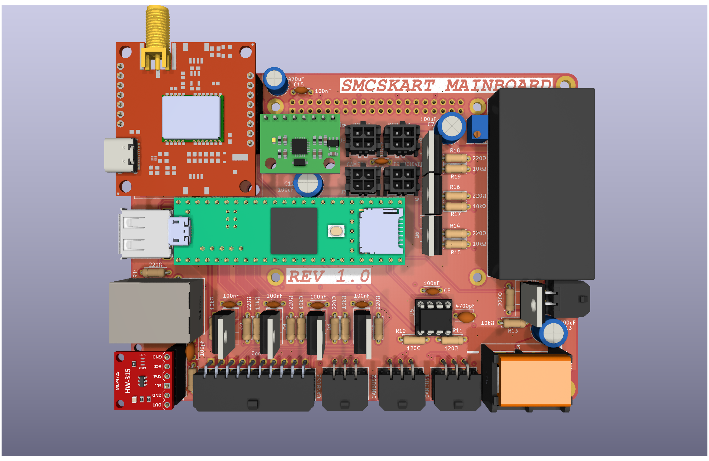

# SMCSKart Mainboard

Custom PCB integrating every system in the SMCS Robotics 8th period go-kart. The board acts as the central hub between a Raspberry Pi 4, a Teensy 4.1, all motor controller I/O, sensors, and peripherals.

  
  

---

## Components

| Component | Description |
|-----------|-------------|
| Raspberry Pi 4 | Main compute; connected via 40-pin header |
| Teensy 4.1 | Real-time microcontroller with onboard Ethernet |
| NEO-M9N | GPS module (connected to Pi I2C + PPS to Teensy) |
| MPU6050 | 6-axis accelerometer/gyroscope (connected to Pi I2C) |
| MCP4725 | 12-bit DAC for throttle signal generation (connected to Teensy I2C) |
| MCP2562-E/P | CAN bus transceiver |
| IRLZ44N | Logic-level N-channel MOSFETs for all toggle/switch outputs (with pulldown resistors) |
| ND721000 | FarDriver BLDC/PMSM speed controller (RS232 interface) |

---

## Power Rails

The board supplies three voltage rails available on the extra power port:

| Rail | Voltage |
|------|---------|
| 3V3 | 3.3 V |
| 5V | 5 V |
| 24V | 24 V (also used for LED strip) |

---

## Teensy 4.1 Pin Assignments

### Serial / UART

| Pin(s) | Interface | Connected To | Notes |
|--------|-----------|--------------|-------|
| 0, 1 | Serial1 (TX, RX) | ND721000 ESC | RS232 level — programming/telemetry port on ESC |
| 7, 8 | Serial2 (TX, RX) | Raspberry Pi 4 | UART bridge between Teensy and Pi |
| 14, 15 | Serial3 (TX, RX) | Transceiver module | RF/wireless transceiver comms |
| 34, 35 | Serial8 (TX, RX) | FPV camera | UART control for FPV camera |

### I2C

| Pin(s) | Bus | Connected To |
|--------|-----|--------------|
| 18, 19 | SDA, SCL | MCP4725 DAC (throttle control) |

### CAN Bus

| Pin(s) | Signal | Notes |
|--------|--------|-------|
| 30, 31 | CRX, CTX | Via MCP2562-E/P transceiver; 120 Ω termination required at each end |

### Digital I/O — ESC Control & Sensors

All toggle output pins drive an IRLZ44N MOSFET with a pulldown resistor, providing an active-low ground signal to the ESC connector.

| Pin | Function | ESC Signal | Direction |
|-----|----------|------------|-----------|
| 2 | Hall Pulses input | Hall Pulses (ESC pin 18) | Input from ESC |
| 3 | Reverse toggle | REV (ESC pin 8) | Output to ESC |
| 4 | Brake toggle | Low Brake (ESC pin 21) | Output to ESC |
| 5 | High speed toggle | High Speed (ESC pin 3) | Output to ESC |
| 6 | Low speed toggle | Low Speed (ESC pin 2) | Output to ESC |
| 9 | Cruise control | Cruise/Boost connector | Output to ESC |
| 10 | PPS | NEO-M9N GPS pulse-per-second | Input from GPS |
| 32 | Contactor toggle | Main contactor relay | Output |

### PWM — LED Strip (24 V)

| Pin | Channel |
|-----|---------|
| 37 | Red |
| 36 | Green |
| 33 | Blue |

### Auxiliary (EX1–EX5)

| Pin | Label |
|-----|-------|
| 25 | EX1 |
| 26 | EX2 |
| 27 | EX3 |
| 28 | EX4 |
| 29 | EX5 |

---

## Raspberry Pi 4 I2C Bus

| Device | Address | Function |
|--------|---------|----------|
| NEO-M9N | — | GPS module |
| MPU6050 | 0x68 | Accelerometer / Gyroscope |

---

## ND721000 ESC Interface

The Teensy communicates with the ND721000 over **Serial1 (pins 0/1) at RS232 levels** (programming/telemetry port). In addition, discrete signals are routed between the board and the ESC's connector harness.

### ESC Connector Pin Reference

| ESC Pin | Color | Signal | Direction | Teensy Pin | Notes |
|---------|-------|--------|-----------|------------|-------|
| 1 | Yellow | Hall A | → ESC | — | Motor hall sensor A |
| 2 | Blue-White | Low Speed | ← Teensy | 6 | Ground to activate low speed profile |
| 3 | Yellow-White | High Speed | ← Teensy | 5 | Ground to activate high speed profile |
| 4 | Red | HALL+ | — | — | ~14 V supply to hall sensors / encoder |
| 5 | Brown-Yellow | CAN L | ↔ | — | CAN bus low (optional; 120 Ω termination required) |
| 6 | Black | GND (Hall) | — | — | Hall sensor ground |
| 7 | Black | B− / GND | — | — | Battery negative / signal ground |
| 8 | Brown-White | REV | ← Teensy | 3 | Ground to request reverse direction |
| 9 | Purple | Speedometer signal | → | — | Analog speed output for speedometer gauge |
| 10 | Orange | Key | — | — | Main power-on input (connect to key switch via 5A fuse) |
| 11 | Gray | High Brake | ← Teensy | 4 | Active-high (12 V) brake input |
| 12 | Green | Hall B | → ESC | — | Motor hall sensor B |
| 13 | Light-Blue | SPD (digital speed pulse) | → | — | Square-wave RPM output for digital speedo / ECU |
| 14 | Black-White | FW (anti-theft) | ← | — | Ground to activate anti-theft lockout (error code 6) |
| 15 | Red-Yellow | CAN H | ↔ | — | CAN bus high (optional; 120 Ω termination required) |
| 16 | Black | GND (serial/switch) | — | — | Signal ground for serial and switch circuits |
| 17 | White | Hall P (encoder index) | → ESC | — | Once-per-revolution encoder reference pulse |
| 18 | Brown | Hall Pulses signal | → Teensy | 2 | Speed pulse output used as tachometer reference |
| 19 | Brown-Red | Lock Phase | — | — | Anti-theft motor phase lock wire |
| 20 | Orange | Key (anti-theft) | — | — | Secondary key input for anti-theft subsystem |
| 21 | Yellow-Green | Low Brake | ← Teensy | 4 | Active-low brake input; ground to signal braking |
| 22 | Blue | Hall C | → ESC | — | Motor hall sensor C |
| 23 | Brown-Blue | TxD (serial) | → Teensy | 0 (RX) | ESC serial transmit → Teensy Serial1 RX |
| 24 | White | Motor Temp | → ESC | — | Motor temperature sensor (PTC/NTC/KTY) |
| 25 | — | — | — | — | — |
| 26 | Black | GND (throttle/brake) | — | — | Shared signal ground for throttle and brake circuits |
| 27 | Green-White | TPS (throttle) | ← DAC | — | Throttle position signal (0.5–4.3 V); driven by MCP4725 |
| 28 | Red-White | ACC+ (5 V) | → throttle sensor | — | 5 V regulated supply for throttle sensor |
| 29 | Brown-Green | V+ (serial power) | → adapter | — | 5 V supply for USB-TTL programming adapter |
| 30 | Pink | B+ (anti-theft) | — | — | Always-live battery positive for anti-theft device |
| 31 | Brown-Red | RxD (serial) | ← Teensy | 1 (TX) | ESC serial receive ← Teensy Serial1 TX |

> **Note:** High Brake (pin 11) is active-high (12 V) while Low Brake (pin 21) is active-low (GND). Both can signal braking; the board uses pin 21 via MOSFET toggle (Teensy pin 4).
> **Note:** Medium speed mode is the ESC default when neither High Speed nor Low Speed is grounded.

---

## External Connectors / Ports

| Port | Description |
|------|-------------|
| 40-pin header | Raspberry Pi 4 HAT connector |
| USB-A | HID peripheral (keyboard, gamepad, etc.) |
| Ethernet | Networking (Teensy 4.1 native Ethernet) |
| CAN × 3 | CANBUS + I2C interface ports |
| Contactor | Trigger port for main contactor relay (Teensy pin 32) |
| FPV camera | UART port (Teensy Serial8, pins 34/35) |
| Transceiver | RF transceiver UART port (Teensy Serial3, pins 14/15) |
| Power port | Extra 3V3 / 5V / 24V supply breakout |
| LED strip | 24 V RGB PWM output (pins 37, 36, 33) |

Made by Eli Ferrara, SMCS Class of 2026
MIT License