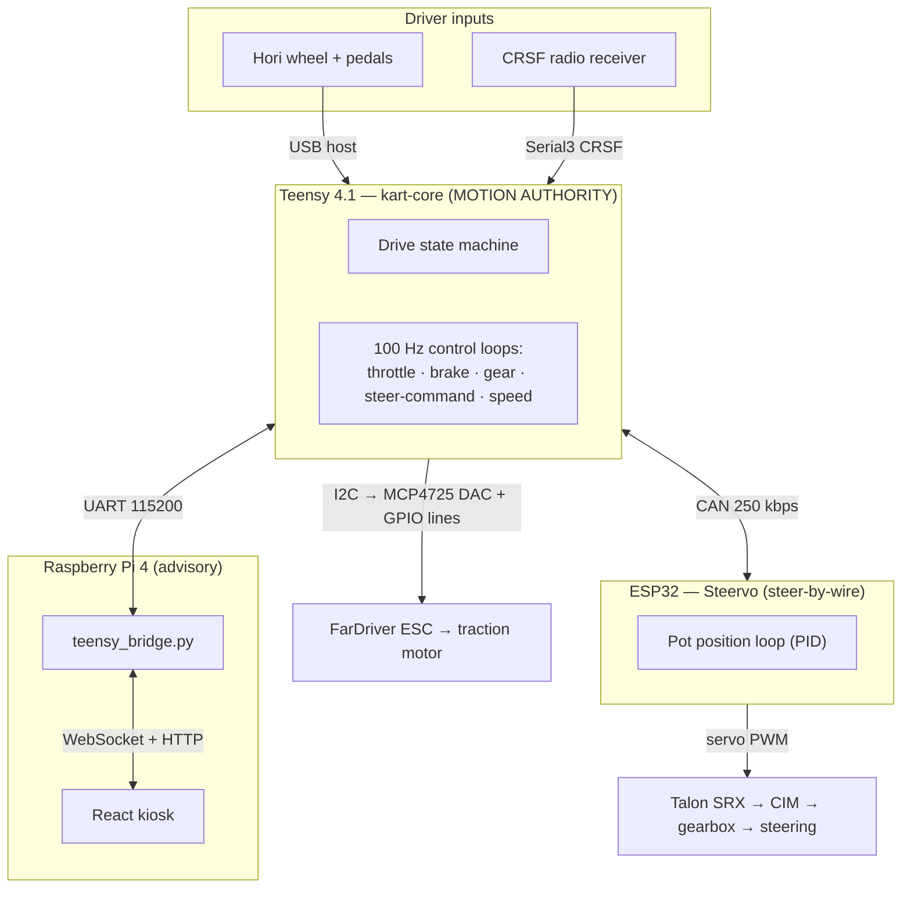

# System Architecture

The go-kart software runs across **three computers** connected by a custom
mainboard. Each has a distinct job, and the boundaries between them are chosen so
that the safety-critical part is small, isolated, and independently testable.

## The three computers

| Node | Hardware | Responsibility | Can it move the kart? |
|---|---|---|---|
| **kart-core** | Teensy 4.1 | Read inputs, run the state machine and control loops, drive all traction outputs, command steering. | **Yes — it is the only one that can.** |
| **Steervo** | ESP32 | Run the steering position loop locally; obey steering commands only when they are fresh and valid. | Steering only, and only on the Teensy's command. |
| **Pi / dashboard** | Raspberry Pi 4 | Display telemetry, GPS map, lights control, diagnostics. | **No.** Purely advisory. |

## The authority hierarchy (safety invariant)

The single most important design rule:

!!! abstract "Authority invariant"
    The **Teensy is the single source of motion authority.** The Pi can *request*
    (LED color, view telemetry, issue a disarm) but nothing it sends produces
    motion unless the Teensy's state machine is already in a driving state with a
    healthy driver-input chain. A crashed or absent Pi never affects driving. The
    Steervo never energizes the steering motor except on fresh, valid setpoints
    from the Teensy.

This is why the dashboard can be rebooted, updated, or fail entirely while the
kart keeps driving, and why a bug in the (large, fast-moving) UI code can never
be a safety bug.

## The buses

The mainboard wires the three computers and all the peripherals together. The
[Mainboard Pin Map](SMCSKart-Mainboard/README.md) is the authoritative reference;
this is the software-relevant summary.

| Bus / link | Between | Speed | Carries |
|---|---|---|---|
| **USB host** | Hori wheel → Teensy | USB | Steering axis, pedals, buttons (via `USBHost_t36`) |
| **Serial3 (pins 14/15)** | CRSF receiver → Teensy | 420 kBaud | RC remote channels (CRSF) |
| **I2C (pins 18/19)** | Teensy → MCP4725 DAC | 100 kHz | Throttle voltage to the ESC |
| **GPIO lines** | Teensy → ESC / contactor | — | Brake, reverse, speed-select, precharge, contactor (MOSFET-switched grounds) |
| **CAN (pins 30/31)** | Teensy ⇄ Steervo | 250 kbps | Steering setpoints + status ([CAN protocol](protocols/can-ids.md)) |
| **Servo PWM (ESP32 GPIO15)** | Steervo → Talon SRX | 50 Hz | Steering motor command |
| **UART / Serial2 (pins 7/8)** | Teensy ⇄ Pi | 115200 | Commands + 20 Hz telemetry ([UART protocol](protocols/uart-protocol.md)) |
| **Serial1 (pins 0/1)** | Teensy ⇄ ESC | RS232 | FarDriver serial (research track — see below) |
| **Pi I2C** | Pi ⇄ GPS / IMU | — | NEO-M9N GPS, MPU6050 IMU |

!!! note "The Talon is *not* on the CAN bus"
    A common point of confusion (and a stale statement in older docs): the Talon
    SRX is driven by **servo PWM**, not CTRE CAN frames. The CAN bus carries
    *only* the two Teensy⇄Steervo message pairs. This is why the bitrate is a
    deliberately conservative 250 kbps. See [Talon PWM Control](steering/talon-pwm.md).

## Two independent motion domains

Below the drive state machine, **traction** (rear motor via the ESC) and
**steering** (Steervo + Talon) are independent subsystems:

- **Traction** can be brought up and tested entirely on the Teensy + ESC with the
  Steervo absent, using *traction-only bench mode* (stands only).
- **Steering** can be brought up on the Teensy + Steervo CAN link independently,
  with its own `STEER ON` enable gate, without arming traction.

The drive state machine is what ties them together for real driving: in a
full-authority (ground) build, steering health is a condition for entering DRIVE.

## What is *not* here

The [Software Stack Plan](SOFTWARE-STACK-PLAN.md) describes a broader roadmap.
Several items in it are **planned but not implemented** and are documented as such
throughout this site (and consolidated in [Hardware & Open Items](hardware-open-items.md)):

- **ESC serial telemetry** (FarDriver RPM / battery / temps) — the wiring exists
  (Serial1), but the dashboard's battery/temperature gauges have **no live source**
  and currently only show simulated values.
- **BMS** (battery management) and **IMU** integration — probes exist; not folded
  into the live telemetry.
- **Camera** — a hardware FPV UART port exists on the board (Serial8), but there
  is no camera software; the dashboard's Camera tab is a placeholder.
