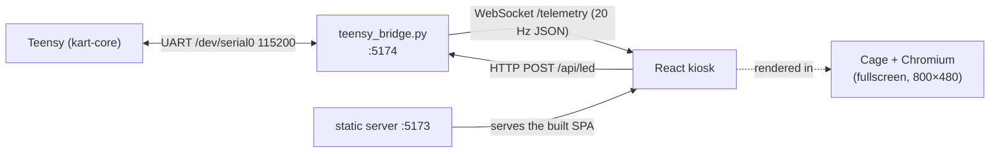

# Dashboard Overview

The dashboard is a **React single-page app** that runs fullscreen on the Raspberry
Pi's touchscreen. It shows the driver everything the kart is doing — speed, gear,
steering, pedals, contactor, a live map — and offers light control and a
diagnostics/simulator panel.

!!! abstract "Advisory only"
    The dashboard **cannot move the kart.** It talks to the Teensy through the
    [UART bridge](uart-bridge.md), and the Teensy's state machine ignores anything
    that could produce motion unless a real driver-input arming action has
    occurred. The dashboard can be rebooted, updated, or crash entirely without
    affecting driving.

## The stack



- **UI:** React + TypeScript, built with Vite, styled with Tailwind, animated with
  Framer Motion.
- **Target:** an **800 × 480** DSI touchscreen. Layout and device-pixel-ratio are
  pinned to that panel.
- **Kiosk:** the SPA is served by a tiny static HTTP server on `:5173`, and
  rendered fullscreen by **Cage** (a Wayland kiosk compositor) driving **Chromium**
  in Ozone/Wayland mode, launched by tty1 autologin. See
  [Pi Kiosk Deployment](../ops/deployment.md).

## The five tabs

The bottom dock switches between five views:

| Tab | What it shows | Page |
|---|---|---|
| **Drive** | Speed dial, gear, steering, battery, pedals, mini-map, contactor, drive state. | [Drive Tab](tab-drive.md) |
| **Map** | A live map (Leaflet + OpenStreetMap) with the kart's GPS position and heading. | [Map Tab](tab-map.md) |
| **Camera** | *Placeholder* — no camera software exists yet. | [Camera Tab](tab-camera.md) |
| **Lights** | Color presets, brightness, and the firmware rainbow effect for the LED strip. | [Lights Tab](tab-lights.md) |
| **System** | Telemetry source selector, live link diagnostics, notification tests, display settings, and a full simulator. | [System Tab](tab-system.md) |

## Telemetry sources

The dashboard can draw its data from three sources, selectable on the System tab:

- **Live** — the real 20 Hz telemetry from the Teensy over the bridge WebSocket.
- **Sim** — a built-in simulator you drive with sliders (great for demos and UI
  work with no hardware). See [System Tab](tab-system.md#simulator).
- **Off** — no source; widgets show a disconnected state.

When there is no live bridge (e.g. developing on a workstation), the views render
with the simulator so the UI is always usable.

## Running it on a workstation

```bash
cd dash
npm install
npm run dev      # http://localhost:5173 with hot reload
```

With no bridge present, pick **Sim** on the System tab to drive the widgets.
