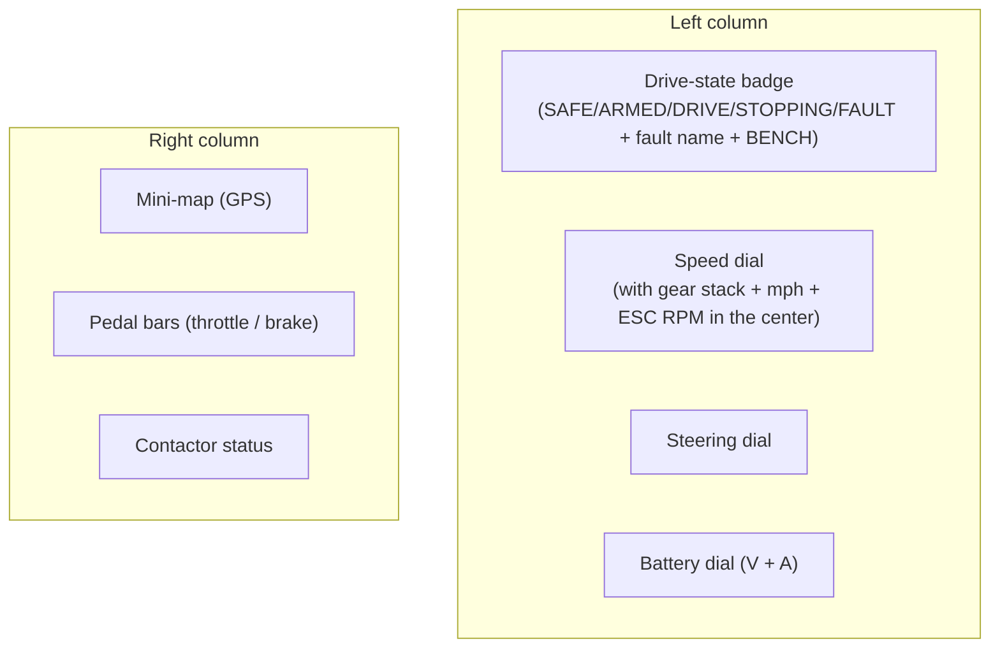

# Drive Tab

The Drive tab is the main driving screen. It presents everything the driver needs
at a glance, laid out for the 800 × 480 panel.

## What's on it

| Widget | Shows | Source |
|---|---|---|
| **Drive-state badge** | Current state, and on FAULT the fault name; a **BENCH** chip in traction-only bench mode. STOPPING/FAULT pulse. | drive state + fault + bench flag |
| **Speed dial** | Road speed in mph. | SPD-pulse speed ([Speedometer](../drive/speedometer.md)) |
| **Gear stack** | The selected gear (Reverse/Park/Low/Med/High), in the dial center. | shift ladder |
| **ESC RPM** | Motor RPM, in the dial center. | *no live source (see below)* |
| **Steering dial** | Measured steering angle and the commanded setpoint. | `STEER_STATUS` measured + `STEER_SET` |
| **Battery dial** | Pack volts and amps. | *no live source (see below)* |
| **Mini-map** | The kart's GPS position/heading. | NEO-M9N GPS |
| **Pedal bars** | Throttle and brake positions (0–100 %). | driver input |
| **Contactor status** | Contactor phase: open / precharge / closed / fault. | contactor sequencer |

The steering dial's sign is negated in the UI so its left/right matches the
driver's view (the firmware's angle sign convention is the opposite of the dial's).

When there is no telemetry, a **"No telemetry — enable a source on the System tab"**
banner appears and the widgets show a disconnected state.

!!! warning "Battery and RPM read empty on a live link"
    The **battery dial** (volts/amps) and the **ESC RPM** readout have **no live
    data source** in the current firmware — they show real values only in **Sim**
    mode. See [Telemetry Pipeline](telemetry.md#what-is-not-live-yet). The speed,
    gear, steering, pedals, contactor, and drive state are all live.
