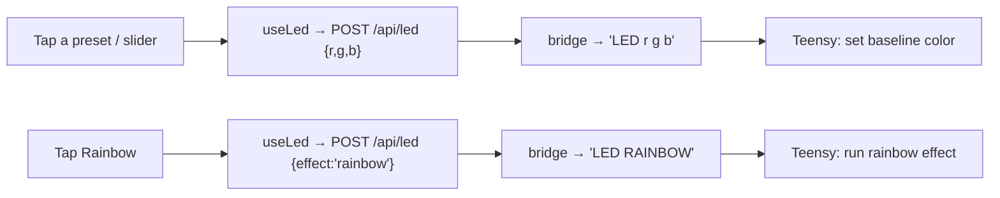

# Lights Tab

The Lights tab controls the kart's **24 V RGB LED strip**. It offers a grid of
color presets, a brightness slider, a **rainbow** effect, and an on/off toggle.

## What the controls do

| Control | Effect |
|---|---|
| **Preset grid** (3 × 3) | Named solid colors (white, red, green, …). Tapping one sends that color to the strip and turns the lights on. |
| **Rainbow tile** | Selects the firmware's animated hue-sweep effect. |
| **Brightness slider** | Scales the solid color 0–100 % (disabled for rainbow, which is firmware-owned). |
| **Power button** | Turns the strip on/off (off sends black). |
| **Header badge** | Shows the bridge status — **Bridge OK** / **Sending…** / **Bridge offline**. |

## How a command reaches the strip

The tab uses the `useLed` hook, which POSTs to the [bridge](uart-bridge.md)'s
`/api/led` endpoint, which sends the matching `LED` command to the Teensy:

- A **solid color** sends `LED <r> <g> <b>` (0–255 each), scaled by the brightness.
- **Rainbow** sends `LED RAINBOW` — a **single** command; the Teensy animates the
  hue sweep itself. The dashboard never streams colors frame-by-frame.

## How the strip actually behaves (firmware side)

The LED strip is **PWM-driven** (`analogWrite` on the Teensy), and the
dashboard-requested color is the **baseline**:

- The dashboard color (or rainbow) is the **steady** display.
- **State-indication changes flash briefly over the top** — a 1-second
  double-blink whenever precharge starts, the contactor closes/opens, or the gear
  shifts into Reverse/Low/Med/High — then it reverts to the baseline.
- **FAULT overrides everything** with a continuous red blink (a latched fault must
  stay loud).
- Until the dashboard sets a color for the first time, the strip shows the legacy
  per-state colors (SAFE magenta/white, ARMED amber, DRIVE gear color, etc.).

!!! note "'Bridge offline' on rainbow was a real bug — now fixed"
    Rainbow briefly reported **Bridge offline** because the firmware's `LED`
    command only accepted `LED r g b` and rejected `LED RAINBOW` (the bridge turned
    that rejection into an HTTP error, which the header shows as "Bridge offline").
    The firmware now implements `LED RAINBOW` as a real hue-sweep effect, so it
    returns `OK` and animates. Solid colors were always fine.
