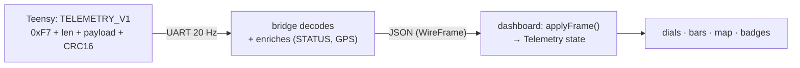

# Telemetry Pipeline

Telemetry flows from the Teensy to the dashboard in two hops: a compact **binary
frame** over the UART, which the [bridge](uart-bridge.md) re-emits as **JSON** over
a WebSocket. The dashboard folds each JSON frame onto its running telemetry state.

## The binary frame (`TELEMETRY_V1`)

The full byte layout is the source-of-truth [UART Protocol](../protocols/uart-protocol.md).
In summary, each 20 Hz frame is `0xF7` sync + length + a `TYPE 0x01` payload +
CRC16, carrying:

- **drive state** and **fault code**;
- **status flags** (wheel connected, steer link OK, steer calibrated, ESC link,
  contactor closed, reverse, brake active, **RC link up**, park, bench mode);
- **throttle %** and **brake %** (driver input positions);
- **steering** setpoint and measured angle (centi-degrees);
- **speed** (from the SPD pulse count / frequency);
- placeholders for **battery volts/amps**, **ESC rpm**, and **controller/motor
  temperatures**.

## The JSON shape (`wire.ts`)

The dashboard's `dash/src/telemetry/wire.ts` is the single place that knows the
bridge's JSON shape. `applyFrame()` folds each (possibly partial) frame onto the
previous telemetry so missing fields keep their prior value, and `decodeState()`
maps the numeric drive state to a label. The UI everywhere else only ever sees the
clean `Telemetry` type — never the wire format.

The bridge also folds in the **GPS** block (fix, lat/lon, heading, satellites) and
the enrichment fields (gear, contactor phase) it gets from polling `STATUS`.

## What is *not* live yet

!!! warning "Battery, current, RPM, and temperatures have no live source"
    The firmware currently sends **zeros / unknown** for battery volts, battery
    amps, ESC rpm, and controller/motor temperatures — there is no ESC-serial
    telemetry parser or BMS reader feeding them. The dashboard's
    [battery dial](tab-drive.md) and any temperature readouts therefore show real
    values **only in Sim mode**; on a live link they read empty (`—`).

    Bringing these live requires the FarDriver ESC-serial telemetry parser and/or
    the BMS reader described in the roadmap — neither is implemented. See
    [Hardware & Open Items](../hardware-open-items.md).

## Link health

The dashboard tracks its own **link state** (connected, update rate in Hz,
frame-age) separately from the telemetry payload. This is what the
[System tab](tab-system.md) diagnostics and the "No telemetry" banner on the Drive
tab use. The WebSocket URL is derived from the page's host and the fixed bridge
port (`5174`).
