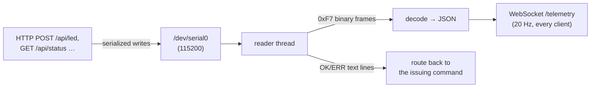

# UART Bridge

The browser cannot talk to a serial port, so a small Python service on the Pi —
`pi/teensy_bridge.py` — sits between the dashboard and the Teensy. It owns the
UART, demultiplexes the two things that share it, and exposes them to the browser
as a WebSocket and a few HTTP endpoints.

## What it bridges

The Teensy shares **one UART** (`/dev/serial0`, 115200) between two interleaved
channels (see [UART Protocol](../protocols/uart-protocol.md)):

- an **ASCII command channel** — `STATUS`, `LED …`, and `OK`/`ERR`/`INFO` replies;
- a **20 Hz binary telemetry stream** — `0xF7`-framed `TELEMETRY_V1` packets.

A single reader thread owns the port and splits the two apart:

Binary telemetry frames are decoded and pushed to **every connected dashboard**
over the WebSocket in the JSON shape `wire.ts` expects; ASCII replies are routed
back to whoever issued a command; and command writes are serialized behind the same
manager so the LED/STATUS endpoints keep working alongside the telemetry stream.

## Endpoints

Served on `127.0.0.1:5174` (localhost only — same trust model as the rest of the
Pi):

| Method + path | Purpose |
|---|---|
| `GET /telemetry` | WebSocket; 20 Hz JSON telemetry frames. |
| `GET /api/health` | `{"ok": true, "serial": "open"\|"closed"}`. |
| `GET /api/status` | The parsed Teensy `STATUS` line as a dict. |
| `POST /api/led {r,g,b}` | Sends `LED <r> <g> <b>` (a solid color). |
| `POST /api/led {effect}` | Sends `LED <EFFECT>` (e.g. `RAINBOW`) — the Teensy runs the animation. |
| `GET /api/gps` | The latest NEO-M9N GPS snapshot (read over the Pi's I2C bus). |

The LED endpoint returns HTTP 200 only when the Teensy replies `OK`; a non-`OK`
reply (or a serial error) becomes a 5xx, which the dashboard surfaces as
**"Bridge offline."** See [Lights Tab](tab-lights.md).

## STATUS enrichment

The binary telemetry frame carries most of what the dashboard needs, but a couple
of fields only appear in the ASCII `STATUS` line. So the bridge **polls `STATUS` at
~4 Hz** purely to enrich the telemetry stream with:

- the **gear** (from the `speed=` field), and
- the **contactor precharge phase** (from the `bus=` field).

Everything else on the dashboard comes from the 20 Hz binary frames.

## GPS

The bridge also reads the **NEO-M9N GPS** module directly over the Pi's I2C bus and
merges position/heading/fix into the telemetry stream (and serves it at
`/api/gps`). This is what drives the [Map tab](tab-map.md) and the drive-view
mini-map.

## Deployment

The bridge runs as a **systemd service** (`gokart-bridge.service`) started at boot,
before the kiosk. See [Pi Kiosk Deployment](../ops/deployment.md) for install and
troubleshooting (including the `curl` one-liners to poke `/api/health`,
`/api/status`, and `/api/led` from an SSH session).

!!! note "Naming"
    Older docs and the roadmap call this daemon `kartd` and describe extra
    responsibilities (blackbox logging, BMS, IMU). Today it is `teensy_bridge.py`
    with the endpoints above; those extras are **not** implemented — see
    [Telemetry Pipeline](telemetry.md) and [Hardware & Open Items](../hardware-open-items.md).
