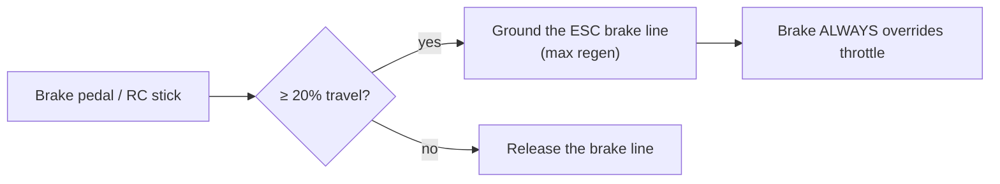

# Brake

!!! danger "There is no friction brake"
    The kart has **no mechanical brake**. All braking is the ESC's electronic
    **regenerative motor braking**, commanded by software. A power or software
    failure removes braking authority — which is why the independent
    [hardware e-stop](../safety.md) exists.

## How braking is commanded

The ESC exposes a **low-brake line** (a discrete input). The firmware drives it
through a MOSFET as a **held ground**: the line is grounded (brake engaged) for as
long as braking is wanted, and released otherwise.

- **Mainboard:** Teensy pin 4 → ESC "Low Brake" (ESC pin 21), active-low.
- It engages the ESC's **highest regen level in one step**, so it is a binary
  input, not a proportional one.

### The pedal is a switch, not a proportional command

Because the ESC's brake input is one-step, the brake pedal (or the RC stick's
lower band) is treated as a **threshold switch**:

- Past **20 %** pedal travel the brake line is held; below it, released.
- Brake **always overrides throttle** — while braking, the throttle DAC is forced
  to zero.
- The brake line is also **forced on during a controlled stop** (the STOPPING
  state) regardless of the pedal.
- Pressing the brake is also one leg of the wheel
  [ARM chord](../inputs/wheel-pedals.md#arming-with-the-wheel-the-arm-chord).

On the RC remote, the same 20 % threshold applies to the lower band of the left
stick — see the [throttle glide band](../inputs/remote-crsf.md#throttle-with-a-glide-band).

## Proportional braking (future / research)

The `SOFTWARE-STACK-PLAN.md` describes a research track toward *proportional*
braking — either by setting the ESC's regen level live over the FarDriver serial
protocol, or by experimenting with a duty-cycled brake line. **Neither is
implemented today**; braking is the one-step threshold switch described above.

!!! note "Two brake lines on the ESC connector"
    The ESC connector exposes both a **Low Brake** (pin 21, active-low) and a
    **High Brake** (pin 11, active-high 12 V). The board drives **Low Brake via the
    MOSFET on Teensy pin 4**. See the [Mainboard Pin Map](../SMCSKart-Mainboard/README.md).
