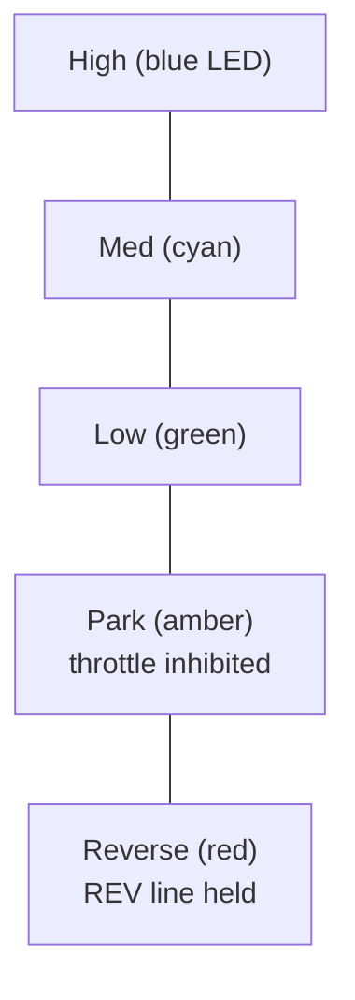

# Reverse & Gearshifting

Direction and speed profile are selected through a single **linear gear ladder**
that the driver moves one rung at a time with the shift paddles (Hori wheel) or the
SE/SF bumpers (RC remote).

## The shift ladder



| Rung | Direction | ESC speed mode | Throttle |
|---|---|---|---|
| **High** | Forward | High | live |
| **Med** | Forward | Med | live |
| **Low** | Forward | Low | live |
| **Park** | — | Low | **inhibited (neutral)** |
| **Reverse** | Reverse | Low | live |

- **Up** = right paddle (wheel bit 13) or **SF** bumper (RC); **down** = left
  paddle (wheel bit 12) or **SE** bumper. One rung per press.
- **Every rung is freely selectable at any time — there is no standstill gating.**
  (An earlier build gated Reverse on "vehicle stopped," but on stands the wheels
  coast for a long time and "stopped" is derived from speed pulses, so Reverse
  became unreachable. The ESC's own direction handling is the backstop against a
  hostile reverse-at-speed.)
- Whenever the kart is **not armed/driving**, the ladder is forced to **Park**, so a
  fresh arm always starts neutral — no throttle is possible until the driver
  deliberately upshifts into a drive gear.

The pure ladder logic lives in `firmware/kart-core/lib/kartcore/shift_ladder.h`
(host-tested).

## Reverse is a *held* line

The ESC's REV input (Teensy pin 3 → ESC pin 8) is driven as a **held ground** — it
is grounded for as long as the Reverse rung is selected.

!!! note "Why held, not pulsed"
    An earlier version pulsed the REV line briefly. On the FarDriver app this only
    *flickered* the ESC into reverse for a split second and then back to first gear.
    Holding the line keeps the ESC in reverse for as long as Reverse is selected.
    Not-armed / Park resolves to forward, so a disarm always ends pointing forward.

## Speed mode is a "gear-cycle button"

This ESC does **not** have discrete Low/Med/High select lines that you set
directly. Instead its high-speed line behaves like a **momentary button** that
**cycles** the gear each time it is grounded:

```
Low → Med → High → Low → …   (one press = one step up, wrapping)
```

So the firmware tracks the ESC's current mode **open-loop** (`g_speedMode`) and
emits the right number of button pulses on the high-speed line to reach the mode
the ladder selects:

- an **upshift** (e.g. Low → Med) = **1 pulse**;
- a **downshift** (e.g. Med → Low) = **2 pulses** (down-one equals up-twice in a
  3-gear wrap).

Park ↔ Low and Park ↔ Reverse do **not** move the ESC speed mode (both hold it in
Low), so they emit no pulse. Pulses are generated by a non-blocking pulser (ground
for ~80 ms, release for ~80 ms, per pulse) so the control loop never stalls.

!!! warning "Open-loop model can drift"
    Because the ESC gives no feedback on its current gear, the firmware's model can
    drift from what the FarDriver app shows (e.g. after a missed pulse). Resync it
    with the **`GEAR <low|med|high>`** serial command, which sets the model without
    pulsing. The LED gear color (green/cyan/blue) is the quick visual check.

## Medium is the ESC default

Medium speed mode is the ESC's default when neither the high-speed nor low-speed
line is grounded. The FarDriver-app-side configuration of the speed profiles
(what each mode actually does) is a physical/app setting — see
[Hardware & Open Items](../hardware-open-items.md).
