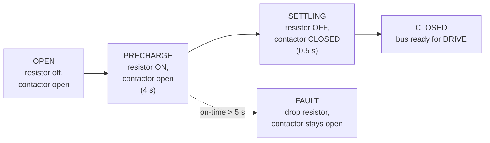

# Arming · Precharge · Contactor

Connecting the traction battery to the ESC is the single most hazardous electrical
step on the kart. The ESC has a large bus capacitance; slamming it onto the pack
with a bare contactor draws a huge inrush current that **welded a contactor shut**
once. So closing the bus is a careful, software-sequenced operation with several
independent safety limits.

## The sequence

When the state machine wants the bus live (entering ARMED), the
`ContactorSequencer` (`firmware/kart-core/lib/kartcore/contactor_seq.h`) runs:

1. **Precharge** — a Teensy-controlled resistor (mainboard GPIO27, HIGH =
   energized) charges the ESC's bus capacitance through a current limit for **4
   seconds**.
2. **Settling** — the resistor is switched **off**, then the main contactor
   (GPIO32) closes, and a **0.5 s** dwell lets the bus settle.
3. **Closed** — the bus is declared *ready*, which lets ARMED advance to DRIVE.

On any disarm / controlled stop / SAFE transition, both the contactor and the
precharge resistor open.

## The safety limits (never raise these)

!!! danger "The precharge resistor melts its enclosure if left energized"
    Two independent limits protect it, both enforced in software:

    - **Hard on-time cap — 5 s.** If the resistor has been energized longer than
      this (a stalled tick, a clock anomaly, a wedged caller), the sequencer drops
      the resistor, leaves the contactor **open**, and latches a
      `CONTACTOR_FAULT`. The main firmware *also* enforces this cap with an
      **independent** timer (not derived from the sequencer's own arithmetic) as a
      belt-and-braces check.
    - **Cooldown — 10 s minimum off-time between precharge cycles.** Rapid
      arm/disarm cycling cannot duty-cycle the resistor hot. A re-engage inside the
      cooldown waits (bus stays open) rather than skipping precharge — skipping
      would be the unsafe shortcut.

    These values live in `firmware/kart-core/src/config.h`
    (`kPrechargeMs`, `kPrechargeMaxMs`, `kPrechargeCooldownMs`, `kContactorSettleMs`).
    **Never** raise the on-time cap or lower the cooldown.

Two more invariants the code guarantees:

- The precharge resistor is energized in **exactly one phase** (PRECHARGE) and
  **never while the contactor is closed** — enforced with a "belt and braces"
  check that refuses to close the contactor while the resistor line is asserted.
- At boot and on any watchdog/fault path, the precharge pin is driven **LOW first**,
  before anything else runs.

## Bus-voltage sense (optional, future)

The sequencer supports an optional bus-voltage sense line: if wired, "ready" would
wait until the bus actually crosses a charged threshold (with the settle time as
an upper-bound timeout that faults), and a mid-drive bus collapse would fault too.

!!! warning "Not wired today — please confirm the hardware"
    The current build has **no bus-voltage sense line** (`has_bus_sense = false`),
    so "ready" is purely the fixed settle dwell. Whether the pack, resistor value/
    wattage, contactor part, and a possible bus-sense line match these timings is a
    **hardware** question not answered by the repo. See
    [Hardware & Open Items](../hardware-open-items.md).

## What the operator sees

- On the dashboard, the [contactor status](../dash/tab-drive.md) shows the phase
  (open / precharge / closed / fault).
- On the LED strip, a precharge start and a contactor close/open each trigger a
  brief flash (see [Lights](../dash/tab-lights.md)).
- Over serial, `STATUS` reports the contactor phase and the `busrdy` gate bit.
