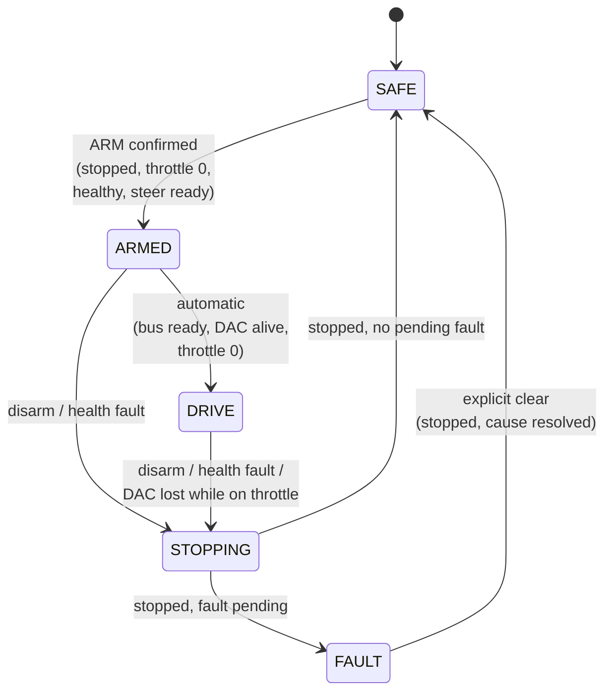

# Drive State Machine

The drive state machine is the **heart of the motion authority**. It is a small,
host-tested piece of pure C++ (`firmware/kart-core/lib/kartcore/drive_state.*`)
that decides, every 100 Hz tick, whether the kart is allowed to move and what its
outputs may do. Everything that can produce motion is gated behind it.

## The five states

| State | Meaning | Outputs |
|---|---|---|
| **SAFE** (0) | Boot state. Everything de-energized, contactor open, throttle at idle. | all off |
| **ARMED** (1) | Traction bus live (precharge done, contactor closed). Waiting to advance to DRIVE. | contactor closed, steering enabled |
| **DRIVE** (2) | Driving. Pedals/stick may command throttle (through the gear ladder). | contactor closed, steering enabled, throttle allowed |
| **STOPPING** (3) | A controlled stop is in progress: throttle cut, brake asserted, contactor still closed until the kart is stopped. | contactor closed, steering enabled, brake asserted |
| **FAULT** (4) | A fault has latched. Requires an explicit clear once the cause is gone and the kart is stopped. | all off |

## How you move through the states

### SAFE → ARMED (arming)

Arming requires **all** of:

- a deliberate **arm request** — the [wheel ARM chord](../inputs/wheel-pedals.md#arming-with-the-wheel-the-arm-chord)
  or the RC **SA** switch;
- every subsystem **healthy** (see the fault table below);
- steering **ready** — calibrated Steervo, *or* traction-only bench mode where
  steering is declared absent;
- the kart **stopped** (speed = 0);
- the **throttle released**.

On entry, the [precharge → contactor](precharge-contactor.md) sequence begins.

### ARMED → DRIVE (automatic)

There is **no separate "go" button.** ARMED advances to DRIVE on its own as soon
as:

- the traction bus is **ready** (precharge done, contactor closed, settle
  elapsed);
- the throttle **DAC is alive** (the operator has turned the ESC key, which powers
  the DAC); and
- the throttle is **released**.

DRIVE only *permits* throttle — the gear ladder still holds the driver in **Park**
(throttle inhibited) until they deliberately select a drive gear. ARMED has **no
inactivity timeout**: it holds the contactor closed indefinitely while the operator
keys the ESC and prepares, because a surprise contactor drop mid-setup was worse
than an indefinite hold on stands (the e-stop and disarm are always available).

### Any state → STOPPING → SAFE/FAULT (controlled stop)

A disarm request or any health fault begins a **controlled stop**: throttle → 0,
brake asserted, contactor kept closed so the ESC can brake, until the kart is
stopped (or a hard **3-second cap** elapses). Then:

- if a fault was pending → **FAULT** (latched, with the fault code);
- otherwise → **SAFE**.

### FAULT → SAFE (clearing)

A latched fault clears only with an **explicit request** (`FAULT_CLEAR`, the wheel
X button, or the RC path), **and** the kart at rest, **and** the original cause —
plus everything else — healthy again.

## Fault codes

| Code | Name | Cause |
|---|---|---|
| 0 | `NONE` | — |
| 1 | `WHEEL_LOST` | No driver input source present (wheel unplugged and RC link down). |
| 2 | `STEER_TIMEOUT` | No Steervo heartbeat for 150 ms. *(suppressed in bench mode)* |
| 3 | `STEER_FAULT` | Steervo reports its own FAULT state. *(suppressed in bench mode)* |
| 4 | `PEDAL_IMPLAUSIBLE` | A pedal reading was out of range past the debounce window. |
| 5 | `DAC_ERROR` | Throttle DAC I2C failed continuously **while throttle was being commanded**. |
| 6 | `ARMED_TIMEOUT` | Informational only — never latched (ARMED has no timeout). |
| 7 | `INTERNAL_WDT` | Hardware watchdog reset. |
| 8 | `CONTACTOR_FAULT` | Precharge/contactor sequencer reported a fault. |

!!! note "Why the DAC is not a general health gate"
    The throttle DAC (MCP4725) is powered from the ESC's ACC+ (key) rail, which
    only comes up **after** the contactor closes and the operator keys the ESC. So
    the DAC is necessarily dead during SAFE and ARMED — requiring it to arm would
    deadlock. Instead, `dac_ok` is a **DRIVE-entry gate** and a **DRIVE-only fault**,
    and only when throttle is actually being commanded (keying off at a stop is
    graceful, not a fault).

## Traction-only bench mode

`kart-core` ships with a compile flag `KART_TRACTION_ONLY_BENCH = 1` in
`src/config.h`. It is a **stands-only** configuration that:

- removes **only** the "steering healthy and calibrated" DRIVE-entry condition,
  and
- suppresses the two Steervo watchdog faults (`STEER_TIMEOUT`, `STEER_FAULT`).

Everything else — pedal plausibility, precharge sequencing, throttle handling,
stopped-to-enter-DRIVE, brake override, controlled stop on every other fault — is
unchanged. There is **no steering authority** in this mode.

!!! danger "This build must never touch the ground"
    Traction-only bench mode is valid **only with the driven wheels lifted**. The
    dashboard and LED strip signal it loudly (SAFE shows magenta instead of white).
    Set `KART_TRACTION_ONLY_BENCH = 0` and reflash for any ground-driving build, so
    steering health gates DRIVE.
