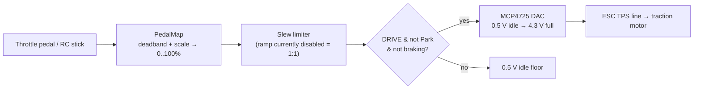

# Throttle

The FarDriver ESC takes an **analog throttle voltage** on its TPS (throttle
position sensor) line, the same as it would from a physical pedal potentiometer.
The kart-core firmware synthesizes that voltage with a **12-bit DAC** (MCP4725),
so the driver's pedal (or the RC stick) becomes a clean analog command the ESC
understands.

!!! abstract "Datasheet"
    [MCP4725 12-bit I²C DAC (PDF, 1.5 MB)](../reference/PDF/Mainboard/MCP4275-DAC-Spec.pdf)
    — see all component datasheets on the [Datasheets](../reference/datasheets.md) page.

## The path

1. **Pedal map** — the raw pedal/stick value is deadbanded (a small released-zone
   suppresses noise) and scaled to **0–100 %**.
2. **Slew limiter** — an optional rate limiter that ramps the commanded percentage.
   It is currently **disabled** (rise ramp = 0 = instant), so response is **1:1**
   with the pedal now that the kart is approaching ground driving. A conservative
   rise ramp was an early bench safeguard against lurching on stands; re-enabling
   it is a one-line config change.
3. **Gating** — the DAC is only driven while the state machine is in **DRIVE**, the
   gear is **not Park**, and the brake is **not** engaged. Otherwise the DAC holds
   the **0.5 V idle floor** (zero throttle).

## The DAC

- **MCP4725**, 12-bit, on the Teensy I2C bus (mainboard pins 18/19).
- Output maps **0.5 V (idle) → 4.3 V (full)** on a 5.0 V reference.
- I2C runs at a conservative **100 kHz** (400 kHz proved flaky on the header/
  breakout wiring).

### I2C reliability under motor EMI

!!! warning "The DAC's I2C link goes noisy once the motor spins"
    When the traction motor runs, it couples electrical noise into the DAC's I2C
    lines (observed ACK/NACK flicker and occasional silent corruption). The
    firmware defends against this in software:

    - each write is **read back and verified** against the commanded value (with
      the power-down bit checked), so silent corruption is caught, not just NACKs;
    - failed writes are **retried** (with a bus re-init between tries);
    - a `DAC_ERROR` fault is only raised after the link has been **continuously**
      failing for 500 ms — so a transient NACK never drops DRIVE, but a genuinely
      dead DAC still faults.

    The **durable fix is hardware** (stronger I2C pull-ups to 3.3 V, routing SDA/
    SCL away from the motor phases, DAC VCC decoupling) — see
    [Hardware & Open Items](../hardware-open-items.md).

!!! note "Power sequencing"
    The DAC is powered from the ESC's ACC+ (key) rail, so it is only alive after
    the contactor closes and the operator turns the ESC key. This is why `dac_ok`
    is a DRIVE-entry gate rather than an arming condition — see the
    [Drive State Machine](state-machine.md#fault-codes).

## Bench measurement

`DACSET <percent>` holds a fixed throttle voltage for ~10 seconds **in SAFE only**
(contactor open, so no motion is possible) for metering the TPS line with a
multimeter or scope. `DACREAD` reads back the DAC register and power-down bits to
confirm what was actually stored.
