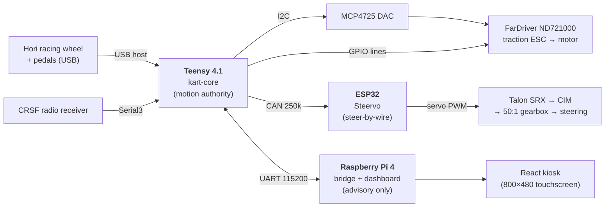

# SMCS Go-Kart Software

Welcome to the complete software documentation for the **SMCS Robotics
drive-by-wire go-kart** — a full-size electric kart with no mechanical linkage
between the driver and the wheels. Everything the kart does (throttle, braking,
steering, gear selection, lights) is mediated by software running across three
computers on a shared custom mainboard.

This site explains **every feature that exists in the code today**, how it works,
and how to operate it. Where a detail depends on physical hardware that is not
captured in the repository, it is called out explicitly rather than guessed at —
see [Hardware & Open Items](hardware-open-items.md) for the consolidated list.

!!! danger "Read the Safety page first"
    The kart has **no friction brake** — all braking is electronic (ESC motor
    braking). A motor can move under software command. Before touching hardware,
    read **[Safety](safety.md)**. Never spin a traction or steering motor without
    the bench supervisor's explicit go-ahead and the driven wheels lifted.

## What the kart is made of

| Component | Role | Documented in |
|---|---|---|
| **Teensy 4.1 — `kart-core`** | The single **motion authority**. Runs the drive state machine, reads the wheel/pedals and the CRSF radio, drives the throttle DAC and the ESC's discrete lines, sequences the precharge/contactor, and commands steering over CAN. | [Drive Control](drive/state-machine.md) |
| **ESP32 — `Steervo`** | Steer-by-wire controller. Runs a closed-loop position controller against a steering potentiometer and drives the Talon SRX by servo PWM. | [Steering](steering/overview.md) |
| **Raspberry Pi 4** | Dashboard, telemetry, GPS, and the browser↔Teensy bridge. **Advisory only** — nothing it sends can move the kart. | [Dashboard](dash/overview.md) |
| **React kiosk** | The touchscreen UI (Drive, Map, Camera, Lights, System tabs). | [Dashboard tabs](dash/tab-drive.md) |

## The authority model (why the kart is safe by design)

The **Teensy is the only device that can produce motion.** The Pi and the
dashboard can *request* things (set an LED color, ask to view telemetry) but the
Teensy's drive state machine gates every output that can move the kart. A crashed,
disconnected, or compromised Pi has **zero** effect on driving. Likewise, the
Steervo never energizes the steering motor except on a fresh, valid stream of
setpoints from the Teensy.

Read the full reasoning in [System Architecture](architecture.md).

## Firmware versions documented here

This documentation describes the **current, finished product** (not the
development history):

| Firmware | Version | Notes |
|---|---|---|
| `kart-core` (Teensy 4.1) | `0.5.2-rc` | Wheel + CRSF remote driving, LED effects |
| `steervo` (ESP32) | `0.3.x` | Closed-loop steering with self-recovering fault handling |

!!! note "Build configuration"
    `kart-core` currently ships with `KART_TRACTION_ONLY_BENCH = 1` — a
    **stands-only** build in which steering health does not gate DRIVE. This is a
    one-line change (`src/config.h`) that must be `0` for any build that will ever
    touch the ground. See the [Drive State Machine](drive/state-machine.md#traction-only-bench-mode).

## Where to start

- **New to the project?** [System Architecture](architecture.md) → [Drive State Machine](drive/state-machine.md).
- **Operating the kart on the bench?** [Bench Bring-up](ops/bringup.md).
- **Working on the dashboard?** [Dashboard Overview](dash/overview.md).
- **Working on steering?** [Steering Overview](steering/overview.md).
- **Looking for exact wire formats?** [UART Protocol](protocols/uart-protocol.md) · [CAN Protocol](protocols/can-ids.md).
