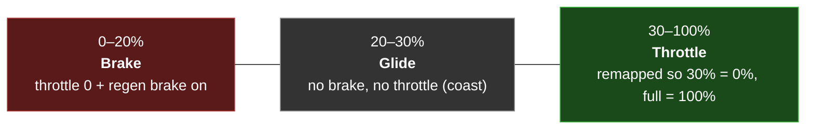

# Remote Control (CRSF)

The kart can be driven **remotely** with a hobby-grade R/C transmitter. A CRSF
receiver is wired to the Teensy's `Serial3`, and the Teensy treats the radio as a
full driver-input path — throttle, steering, gear, and arm/disarm — alongside the
Hori wheel.

## What CRSF is

**CRSF (Crossfire / ExpressLRS)** is a serial R/C link protocol. The receiver
streams the state of all transmitter controls **continuously** (not just on
change) as compact framed packets over a UART. The Teensy runs a CRSF decoder
(ported from the proven bring-up firmware into a host-tested library) that:

- syncs on the CRSF address byte, bounds-checks each frame, and validates its
  CRC8;
- unpacks the **16 channels** (each an 11-bit value, `172…1811`, center `≈992`);
- decodes the link-statistics frame (RSSI, link quality, SNR).

- **Port:** `Serial3` (mainboard "Transceiver" connector, Teensy pins 14/15)
- **Baud:** 420 000 (CRSF standard)

## RC wins while its link is up

The arbitration rule is simple:

!!! abstract "Input authority"
    **RC commands the kart whenever its link is up.** The Hori wheel only takes
    over if the RC link drops — *or* if the driver flips the **SD** switch to hand
    control back to the wheel (see below). When the RC link is down and no wheel is
    present, the kart simply sits still (no input source is driving it).

## Control scheme

The mapping from physical transmitter controls to CRSF channels is set by the
**transmitter's own mixer**, not the firmware. The table below is the default the
firmware expects; the channel indices live in `firmware/kart-core/src/config.h`
(`kRcCh*`) and can be edited to match your radio.

| Control (default channel) | Function |
|---|---|
| **Left stick — up/down** (CH3) | **Throttle**, with a glide band (see below). |
| **Left stick — left/right** (CH4) | **Steering** (drives the same `STEER_SET` path as the wheel). |
| **SF bumper** (CH10) | **Upshift** one gear (Reverse → Park → Low → Med → High). |
| **SE bumper** (CH9) | **Downshift** one gear (… → Park → Reverse). |
| **SA switch** (CH5) | **Remote startup / shutdown.** ON → arm (precharge → contactor → auto-DRIVE, starting in Park). OFF → disarm (controlled stop → SAFE). |
| **SD switch** (CH8) | **Hand control to the Hori wheel + pedals.** ON → RC relinquishes and the in-seat wheel drives. OFF → RC drives. |

### Throttle with a glide band

The left stick is the only "pedal" on the radio, so it does triple duty with a
neutral coast band in the middle:



Below 20 % the stick engages the ESC regen brake (like lifting off a car's
accelerator into engine braking); 20–30 % coasts with no brake and no throttle;
above 30 % it delivers throttle, remapped so there is **no lurch** as the stick
crosses out of the glide band. Reverse is reached by shifting **down** past Park
with SE — there is no separate reverse control.

### Handing control to the wheel (SD)

Flipping **SD on** while the RC link is up hands throttle/steer/shift/arm to the
in-seat Hori wheel and pedals. This is **not** a dead-man — the link stays up, so
the handover never forces Park. Flipping SD off returns control to the radio.

## The dead-man (link loss → Park)

Because CRSF streams continuously, a lost link is detected as **no valid frame for
500 ms**. On loss the firmware **snaps the gear ladder to Park** (throttle cut,
regen brake engaged) while leaving the **contactor closed** — the kart parks, it
does not shut down. It is re-drivable the moment the link returns by upshifting out
of Park; no fault-clear is needed. In a pure-RC build (no wheel plugged in) a latch
keeps this from tripping the wheel-lost fault, so the kart stays cleanly parked.

!!! danger "Configure the receiver failsafe to *No Pulses*"
    The dead-man only works if the receiver **stops transmitting** on signal loss.
    If the receiver is configured to *hold last position*, it will keep sending the
    last throttle value and defeat the dead-man entirely. Set the ELRS/CRSF
    receiver's failsafe mode to **"No Pulses."**

## Binding & channel setup

The firmware side is complete and tested. The **radio side** — pairing the
transmitter to the receiver and assigning physical controls to channels — is
configured on the transmitter itself and is **not** captured in this repository.

!!! warning "Physical / radio setup not in the repo — please fill in"
    The following are transmitter/receiver-specific and must be supplied:

    - **Transmitter and receiver models** actually used on this kart (older
      bring-up notes reference a BetaFPV transmitter and a SuperX/ELRS receiver,
      but this is unconfirmed for the current build).
    - **The binding procedure** (the physical button/steps to pair TX ↔ RX).
    - **The transmitter mixer setup** — how each physical control (left stick,
      SA, SD, SE, SF) is assigned to CH1–CH16 on the radio. The firmware defaults
      assume the ELRS AETR layout in the table above and have been **confirmed
      working on this kart**, but the radio-side mixer configuration steps are not
      documented here.
    - **The receiver's physical wiring** to the mainboard Transceiver connector
      beyond "receiver TX → Teensy pin 15, plus 5 V and ground."

    See [Hardware & Open Items](../hardware-open-items.md).

## Confirming the channel map on the bench

Use the `RX?` serial command to verify which channel each control lands on before
trusting the map:

```
RX?
OK RX link=1 frames=1234 bad_crc=0 age_ms=12 rssi1=… rssi2=… lq=100 snr=… ch=992,992,172,992,1811,…
```

Move one control at a time and watch which of the 16 `ch=` values changes. If a
control lands on a different channel than the default, edit the matching `kRcCh*`
constant in `config.h` and reflash. `RX?` also reports the live link state,
frame/CRC counts, last-frame age, and link statistics — a quick way to confirm the
receiver is wired, bound, and streaming (`link=1`, `frames` climbing, `bad_crc=0`).

The steering channel is fully wired but **inert in the current stands-only build**
(the Steervo's steering authority is gated off in traction-only bench mode); it
becomes live in a ground-driving build.
