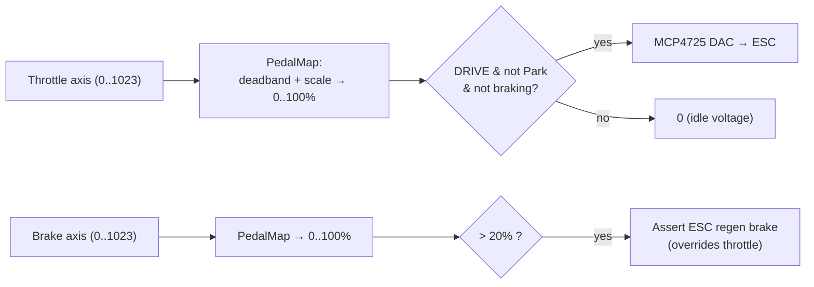

# Hori Wheel & Pedals

The primary in-seat driver input is a **Hori Racing Wheel Overdrive** (a USB HID
racing wheel with a throttle and brake pedal set). It plugs into the mainboard's
USB-A port, which routes to the **Teensy USB host** header. The Teensy enumerates
it with the `USBHost_t36` library and reads the axes and buttons directly — the
wheel is on the motion-authority computer, not the Pi.

- **Vendor / product:** `0f0d:0152` (Hori). Enumerates through `USBHost_t36` as an
  Xbox-One controller (`joystickType 3`).
- On connect, the Teensy prints `INFO WHEEL_CONNECTED vid=… pid=… type=…` to both
  its USB serial and the Pi UART.

!!! warning "Two different input maps — use the Teensy one"
    The Linux `js`/evdev map in the hardware note
    [Hori Wheel (hardware)](../SMCSKart-Mainboard/steering-wheel.md) is **not** the
    same as the map the Teensy sees through `USBHost_t36`. The triggers are
    `0…1023` unsigned (not `±32767`) and the indices are shifted. The **Teensy map
    below is authoritative** for firmware behavior; the `js` map only applies to
    the (legacy) Pi-USB fallback path. Always re-confirm with the `WHEELRAW`
    command if the wheel firmware or library version changes.

## Axis map (Teensy `USBHost_t36`)

| Axis | Control | Range | Used for |
|---|---|---|---|
| **0** | Steering wheel | `-32768` (full left) … `+32767` (full right), centered at 0 | Steering setpoint |
| **3** | Brake pedal | `0` released … `1023` pressed | Brake |
| **4** | Throttle pedal | `0` released … `1023` pressed | Throttle |

The steering axis rarely reaches the raw extremes (mechanical lock is inside the
electrical range), so the usable range is treated as a calibration. The pedal
calibration (`released = 0`, `pressed = 1023`) plus a 3 % deadband and a
plausibility margin are configured in `firmware/kart-core/src/config.h` and can be
adjusted live with the `CFG` command.

## Button map (Teensy `USBHost_t36`)

The Hori reports its face buttons on consecutive bits and its paddles on bits
12/13:

| Bit | Physical control | Function |
|---|---|---|
| **12** | Left shift paddle | **Downshift** one gear |
| **13** | Right shift paddle | **Upshift** one gear |
| **6** | **X** face button | Backup: in DRIVE → disarm; in FAULT → clear (DRIVE entry is automatic, so this is not needed to drive) |
| **5** | **B** face button | **Disarm** / turn off (controlled stop → SAFE) |
| 4 / 7 | A / Y face buttons | (unused) |

## How the pedals become motion

Details for each path:

- **Throttle** is deadbanded and scaled to 0–100 %, then written to the throttle
  DAC — but only while the state machine is in DRIVE, the gear is not Park, and
  the brake is not engaged. See [Throttle](../drive/throttle.md).
- **Brake** is treated as a **switch**: past 20 % pedal travel the ESC's regen
  brake line is held, and brake always overrides throttle. See
  [Brake](../drive/brake.md).
- **Steering** maps the wheel axis to an angle setpoint sent to the Steervo over
  CAN. See [Steering Overview](../steering/overview.md).
- **Gears** are changed with the paddles. See
  [Reverse & Gearshifting](../drive/gearshift.md).

## Plausibility

Each pedal reading is range-checked against its calibration plus a margin. A
reading that stays implausible (both extremes / out of range) for longer than a
debounce window (250 ms) raises a **pedal-implausible fault** and triggers a
controlled stop. This catches a disconnected or shorted pedal signal.

## Arming with the wheel (the ARM chord)

In a normal (in-seat) build, the driver arms the kart with a deliberate **chord**
rather than a single button, so it can't happen by accident:

!!! example "ARM chord"
    Hold **both shift paddles** (bits 12 + 13) **and** press the **brake pedal**,
    with the **throttle released**, for **1 second**, while the kart is in SAFE and
    stopped. This transitions SAFE → ARMED, which begins the
    [precharge → contactor](../drive/precharge-contactor.md) sequence.

DRIVE then follows **automatically** once the bus is charged and the throttle DAC
is alive — there is no separate "go" button. The gear ladder starts in **Park**
(throttle inhibited) so the driver must deliberately upshift into a drive gear
before any throttle is delivered.

To turn off: press **B**, or send `DISARM` from the dashboard/serial — either
performs a controlled stop back to SAFE.

## Diagnostics

- `WHEELRAW` (serial) dumps the live axis values, button mask, and joystick type —
  use it to confirm the map and pedal ranges.
- `WHEEL?` reports host connection state and button state.

!!! note "USB host re-enumeration after a reflash"
    A Teensy reboot leaves an already-connected wheel dark. After flashing,
    hot-plug the wheel (or power-cycle the board) so the USB host re-enumerates it.
    Confirm with `WHEELRAW` showing `enum=1`.

## Legacy Pi-USB fallback

The wheel can alternately be plugged into a Raspberry Pi USB port, with
`pi/wheel_bridge.py` forwarding button events to the Teensy over the UART
(`WHEEL_BTN` commands). This path uses the Linux `js` map and is a fallback for
when the Teensy USB host cannot bind a device. The **primary and normal** path is
USB-host-direct to the Teensy.
