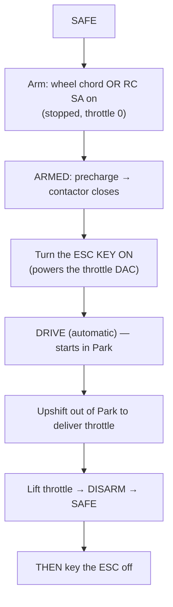

# Bench Bring-up

This page is the operator's guide to bringing the kart up on the bench. It ties
together the detailed track-specific notes:
[Traction Bring-up](../traction-bringup.md), [Steering Bring-up](../steering-bringup.md),
and the [Remote Control](../inputs/remote-crsf.md) setup.

!!! danger "Before anything moves"
    - Lift the driven wheels and secure the chassis.
    - Keep the hardware [e-stop](../safety.md) within reach.
    - No traction or steering motor spins without the bench supervisor's explicit
      go-ahead.
    - The current `kart-core` build is **stands-only** (`KART_TRACTION_ONLY_BENCH = 1`).

## Talking to the Teensy

Connect to the Teensy on `/dev/ttyACM0` @ 115200 (e.g.
`uv run --with pyserial pyserial-miniterm /dev/ttyACM0 115200`). Useful commands
(full list in the [UART Protocol](../protocols/uart-protocol.md)):

- `VERSION`, `PING`, `STATUS` — identity and a full state snapshot.
- `WHEELRAW`, `WHEEL?` — confirm the Hori wheel enumeration and map.
- `RX?` — confirm the CRSF receiver link and channel map.
- `STEER`, `STEER ON/OFF`, `STEER CAL …`, `STEER CFG …` — the steering surface.
- `HALLDIAG` — speed-pulse diagnostics.
- `DISARM` / `SAFE` — always-available stop.

## The power-up → drive → shutdown order (order matters)

!!! warning "Two hardware-ordering rules"
    - **Key the ESC *after* the contactor closes**, never before. Arming closes the
      contactor; turn the key on during ARMED. `STATUS` shows `dac=1` once the key
      powers the DAC, which lets DRIVE engage.
    - **Disarm before keying off.** Keying off while driving cuts DAC power; the
      firmware only faults on that if the throttle is pressed (graceful at a stop),
      but disarm-first is the clean path.

## The three tracks

### Traction (rear motor)

On stands, in traction-only bench mode. Verify the throttle DAC voltage tracks the
pedal, the ESC discrete lines (brake, reverse, speed) toggle correctly, the
precharge/contactor sequence runs, and hall/SPD speed reads. Then, supervised, do
the low-throttle wheel-spin and the fault drills (wheel pull, e-stop, implausible
pedal). Full detail: [Traction Bring-up](../traction-bringup.md).

### Steering (Steervo)

Bring up the CAN link (both firmwares flashed, `STEER` shows `link=1`), verify the
pot sweeps cleanly, calibrate (`STEER CAL ENTER → CENTER → LEFT → RIGHT → SAVE`),
do the motor-disabled direction check, then supervised first motion with a lowered
output limit. Full detail: [Steering Bring-up](../steering-bringup.md).

### Remote control (CRSF)

Wire and bind the receiver, confirm `RX?` shows `link=1` with frames climbing, and
verify the channel map by moving one control at a time. Check the dead-man (power
the transmitter off → the kart parks). Full detail:
[Remote Control (CRSF)](../inputs/remote-crsf.md).

## Monitoring

`STATUS` reports the live health/DRIVE-entry gate bits — watch
`dac busrdy thr0 vstop plaus wheelok` (1 = satisfied) and the cumulative
`dacok/dacfail` counters (their deltas reveal I2C health under motor load). Running
a background poller that prints `STATUS`/`WHEELRAW` during a test is the standard
way to watch what's happening.
