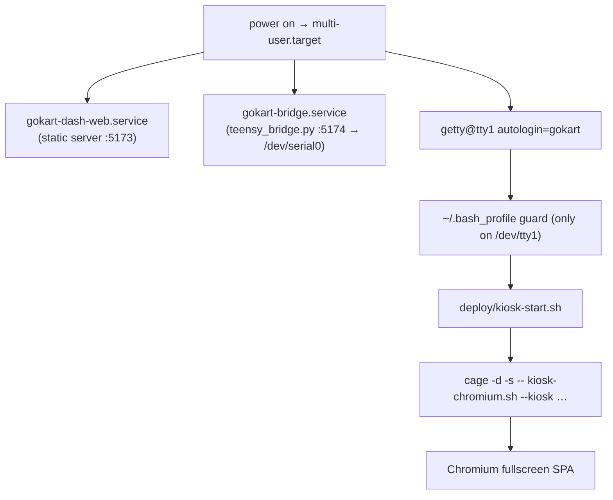

# Pi Kiosk Deployment

The dashboard runs fullscreen on a Raspberry Pi with **Pi OS Lite** (no desktop).
The stack is **Cage** (a Wayland kiosk compositor) driving **Chromium** in
Ozone/Wayland mode, pointed at a localhost static server. The authoritative,
step-by-step guide is `deploy/README.md` in the repo; this is the overview.

## Boot flow



SSH sessions land on `/dev/pts/N` and skip the kiosk launch entirely, so you can
log in and work normally.

## What gets installed

| Installed path | Source |
|---|---|
| `/etc/systemd/system/gokart-dash-web.service` | `deploy/gokart-dash-web.service` (static server) |
| `/etc/systemd/system/gokart-bridge.service` | `deploy/gokart-bridge.service` (the [bridge](../dash/uart-bridge.md)) |
| `/etc/systemd/system/getty@tty1.service.d/autologin.conf` | `deploy/getty-tty1-autologin.conf` |
| `/etc/udev/rules.d/99-gokart-ignore-hdmi-cec.rules` | `deploy/99-gokart-ignore-hdmi-cec.rules` |
| `/etc/udev/rules.d/99-touch-rotate.rules` | `deploy/99-touch-rotate.rules` (touch rotation — see below) |
| `~/.bash_profile` | `deploy/bash_profile.snippet` |

Packages: `cage seatd chromium nodejs npm python3-serial libinput-tools`. The
`gokart` user must be in the `seat` and `dialout` groups. The dashboard is built
with `npm run build` (Vite → `dist/`), which the static server serves.

## Display rotation & touch

The 7″ DSI panel is mounted rotated, so the kiosk applies a **180° output
transform** (`wlr-randr --transform 180` in `deploy/kiosk-chromium.sh`, run from
inside the Cage session).

!!! warning "cage 0.2.0 rotates the display but not touch"
    The kiosk's Cage version applies the output transform to the **display** but
    **not** to touch input, so a rotated display left touches inverted (a tap at the
    top registered at the bottom). The fix is a **libinput calibration matrix** that
    rotates touch 180° at the input layer, installed as
    `deploy/99-touch-rotate.rules`
    (`LIBINPUT_CALIBRATION_MATRIX="-1 0 1 0 -1 1"` on the FT5x06 touch device).
    After installing it: `sudo udevadm control --reload-rules && sudo udevadm
    trigger`, then restart the kiosk (`pkill -x cage` — tty1 autologin relaunches
    it).

The **no-cursor** behavior comes from a separate udev rule that makes libinput
ignore the HDMI-CEC nodes (which falsely advertise a pointer). Verify with
`sudo libinput list-devices` — only the FT5x06 touch device should be listed.

## Everyday operations

- **Rebuild the dashboard:** `cd ~/gokart-dash/dash && npm run build`; the kiosk
  picks it up on the next Chromium reload (or reboot). Clear
  `~/.cache/chromium-kiosk/` to reset cached state.
- **Restart the kiosk:** `pkill -x cage` (autologin relaunches a fresh session).
- **Check the bridge:**
  ```bash
  systemctl status gokart-bridge
  curl -s http://127.0.0.1:5174/api/health
  curl -s http://127.0.0.1:5174/api/status
  ```
- **VT switching** is enabled (`cage -s`): Ctrl+Alt+F2 drops to a console from a
  keyboard on the Pi, Ctrl+Alt+F1 returns to the kiosk.

## Reaching the Pi

!!! note "Physical network details not in the repo"
    How the Pi is reached (hostname/mDNS, IP, credentials) depends on the deployment
    network and is **not** fixed in the repository. It has been reached over a
    laptop-shared Ethernet subnet by IP in the past, but the address can change. See
    [Hardware & Open Items](../hardware-open-items.md).
