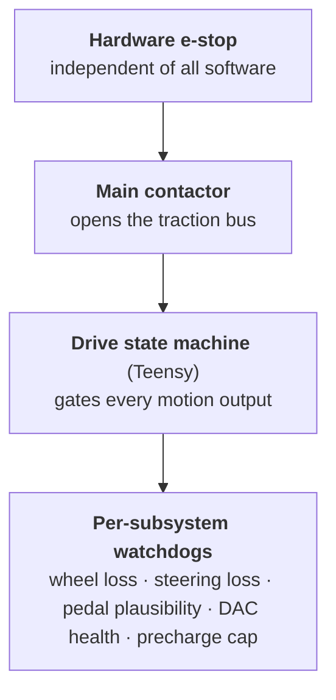

# Safety

The go-kart is a full-size vehicle with electronic-only braking and no mechanical
link between the driver and the wheels. Treat every part of `firmware/` as
safety-critical.

!!! danger "The three non-negotiable rules"
    1. **Never move a motor** (traction or steering) without the bench
       supervisor's explicit go-ahead. First motion is always supervised, on
       stands, with the driven wheels lifted and a way to cut power instantly.
    2. **Precharge before the contactor, always.** Closing the main contactor
       onto an uncharged traction bus once welded a contactor shut. The firmware
       enforces this; never bypass it (see below).
    3. **There is no friction brake.** All braking is the ESC's electronic motor
       braking, commanded by software. A software or power failure removes braking
       authority — which is why the hardware e-stop below exists independently.

## Layers of protection

The kart is protected by several independent layers, from hardware up to software:

### 1. Hardware e-stop

A physical emergency-stop exists **independently of the software** and cuts power
regardless of what any computer is doing. It is the ultimate backstop.

!!! warning "Hardware detail not in the repo"
    The e-stop's wiring, exactly what it interrupts (traction contactor coil,
    main power, or both), and its placement are **physical** and not documented in
    this repository. See [Hardware & Open Items](hardware-open-items.md).

### 2. The drive state machine gates all motion

The Teensy boots into **SAFE** with every output deterministically off and the
contactor open. Motion is only possible after a **deliberate arming action** by
the operator, and any fault triggers a **controlled stop**. The dashboard can
*never* arm the kart by itself. See [Drive State Machine](drive/state-machine.md).

### 3. Precharge / contactor sequencing

The traction pack is connected through a **precharge resistor** so the ESC's bus
capacitance charges gradually before the main contactor closes. The firmware:

- energizes the precharge resistor for a fixed dwell, **then** closes the
  contactor with the resistor off;
- **hard-caps** the resistor's on-time (it melts its enclosure if left energized);
- enforces a **cooldown** between cycles so rapid arm/disarm can't cook it.

These limits are safety constants — never raise them. See
[Arming · Precharge · Contactor](drive/precharge-contactor.md).

### 4. Watchdogs and failsafes

| Failure | Detection | Response |
|---|---|---|
| Driver-input loss (wheel unplugged / RC link dropped with no wheel) | USB-host enumeration + CRSF link timeout | Controlled stop / fault |
| Steering heartbeat loss | No CAN `STEER_STATUS` for 150 ms | Controlled stop (suppressed in traction-only bench mode) |
| Steering fault (pot out of range, stall) | `STEER_STATUS` fault bits | Controlled stop (suppressed in bench mode) |
| Teensy hang | Hardware watchdog (WDOG1, 500 ms) | Reset → boots into SAFE |
| Precharge resistor overrun | Independent on-time cap | Drop resistor, open contactor, latch fault |
| Implausible pedal | Range checks with debounce | Fault after persistence |
| RC link loss (dead-man) | No CRSF frame for 500 ms | Snap to Park (throttle cut, brake on); contactor stays closed |

The Steervo additionally protects **itself** and the steering hardware — see
[Steering Safety & Faults](steering/safety.md).

## Bench discipline

- Work on stands with the **driven wheels lifted** for any motor-capable test.
- Keep the host-side unit tests green — the safety logic (state machine, slew
  limiter, CRSF/CAN parsers, plausibility, steering controller) is all
  host-tested. See [Flashing Firmware](ops/flashing.md).
- Flashing is done by a human, never automatically.
- The current shipped `kart-core` build is **stands-only**
  (`KART_TRACTION_ONLY_BENCH = 1`): it removes the steering-health DRIVE gate and
  is **not** valid on the ground. Flip it to `0` (and reflash) for any
  ground-driving build.
