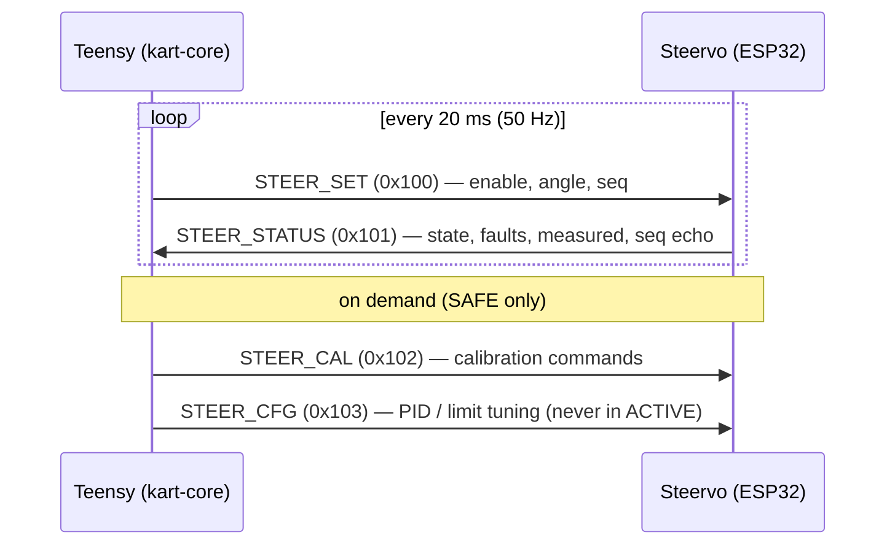

# Teensy ⇄ Steervo CAN Link

The Teensy and the Steervo talk over a **CAN bus**. It is the only digital link
between them, and it is deliberately kept small and slow for reliability. The
authoritative wire format is [CAN Protocol](../protocols/can-ids.md); this page
explains how it is used.

!!! abstract "Datasheet"
    [MCP2562 CAN transceiver (PDF, 0.8 MB)](../reference/PDF/Mainboard/MCP2562-Spec.pdf)
    — see all component datasheets on the [Datasheets](../reference/datasheets.md) page.

## Bus parameters

| Property | Value |
|---|---|
| Bitrate | **250 kbps** (`KART_CAN_BITRATE` in `firmware/common/kart_common/kart_can.h`) |
| IDs | 11-bit **standard** IDs |
| Nodes | Teensy 4.1 (CAN3, mainboard pins 30/31 via an MCP2562), Steervo ESP32 (transceiver on GPIO16/17) |
| Termination | 120 Ω at **exactly the two** physical bus ends |
| Traffic | two 50 Hz frame pairs (~13 kbit/s total) |

!!! note "Why only 250 kbps, and why the Talon isn't on the bus"
    The Talon SRX is driven by **servo PWM, not CAN** (see
    [Talon PWM Control](talon-pwm.md)), so the only traffic is the four kart
    messages below and the bitrate is ours to choose. A slower bitrate means a
    longer bit time, giving reflections from imperfect termination time to settle
    before each sample point — valuable noise margin on a real vehicle harness.
    Both nodes derive their bit timing from the single `KART_CAN_BITRATE` macro, so
    they can never drift apart. (Older docs and the roadmap say "1 Mbps / CTRE CAN"
    — that is retired; 250 kbps is correct.)

## The four messages

| ID | Name | Dir | Rate | Purpose |
|---|---|---|---|---|
| `0x100` | **STEER_SET** | Teensy → Steervo | 50 Hz | `ENABLE` bit + target angle (centi-degrees) + rolling `seq`. |
| `0x101` | **STEER_STATUS** | Steervo → Teensy | 50 Hz | `state`, `fault_bits`, measured angle, output %, `seq` echo, raw pot. |
| `0x102` | **STEER_CAL** | Teensy → Steervo | on demand | Guided calibration commands (accepted only in SAFE). |
| `0x103` | **STEER_CFG** | Teensy → Steervo | bench only | Live PID / limit tuning (ignored while ACTIVE). |

Angles are **centi-degrees** (`int16`, `+100` = 1.00° right of center); full lock
is `±3000` (±30.00°). The wheel's full deflection maps to those same angles, and
the Steervo's calibration assigns them to the captured pot stops — so a wheel
setpoint means the same physical position the pot was calibrated to.

## The two safety-critical timeouts

Both directions have a **150 ms** heartbeat requirement:

- **`STEER_SET` staleness (Steervo side):** if the Steervo receives no valid
  `STEER_SET` with `ENABLE`=1 for 150 ms, it de-energizes the motor, sets the
  `SETPOINT_STALE` fault bit, and stays in READY until fresh frames resume.
- **`STEER_STATUS` heartbeat (Teensy side):** if the Teensy sees no `STEER_STATUS`
  for 150 ms — or any frame reporting `state = FAULT` — it treats steering as
  failed. In a full-authority build that triggers a controlled stop; in
  traction-only bench mode the traction side ignores it.

## Link health & self-tests

`kart-core` decodes `STEER_STATUS` with an **interrupt-driven** RX FIFO. (A
polled read serviced the hardware FIFO only ~50 % of calls, overflowing it and
silently dropping still-ACKed frames — the cause of an early ~4–6 % status loss
that flapped the link-OK flag. The bitrate was never the problem.)

Two on-bench diagnostics isolate a dead link to one side:

- **Teensy `CANTEST`** runs a FlexCAN internal loopback (controller only): `PASS`
  means the CAN3 controller is healthy, so a fault is in the transceiver/wiring.
- **Steervo self-test** (`kCanSelfTest = true`) puts the ESP32 in NO-ACK self-
  reception mode and reports `self_rx` / `other_rx` / `tx_fail` counters, proving
  the ESP32 controller + GPIO map + transceiver path, and counting the Teensy's
  frames.

The Teensy `STEER` command and the Steervo's 10 Hz `STAT` USB line both expose live
RX/TX counters for diagnosing a marginal link. See
[Steering Bring-up Notes](../steering-bringup.md) for the full procedure.

!!! warning "Transceiver TX/RX labels are reversed on the ESP32 header"
    The Steervo's transceiver header is silkscreened `CTX=GPIO16 / CRX=GPIO17`, but
    the firmware uses **TX = GPIO17, RX = GPIO16** — the only combination that
    passes the loopback self-test. Do not "correct" the pins to match the
    silkscreen.
