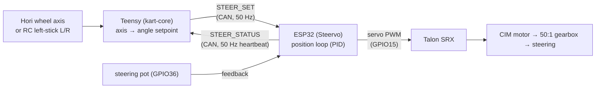

# Steering Overview

The kart steers by wire: there is **no mechanical linkage** between the wheel and
the front wheels. Turning the input (Hori wheel or RC stick) sends an **angle
setpoint** to a dedicated ESP32 controller ("**Steervo**"), which runs a
closed-loop position controller against a steering potentiometer and drives a
**Talon SRX** motor controller by servo PWM.

## The chain

## Division of labor

The two computers split the job cleanly:

| Teensy (`kart-core`) | Steervo (ESP32) |
|---|---|
| Maps the input axis to an angle setpoint (`±30.00°` full lock). | Runs the position loop **locally** against the pot. |
| Sends `STEER_SET` at 50 Hz over CAN, with an `ENABLE` bit. | Drives the Talon by PWM only when it is genuinely ACTIVE. |
| Watches the `STEER_STATUS` heartbeat; treats loss/fault as a steering fault. | Reports measured angle, output, and fault bits at 50 Hz. |
| Owns the wheel→motion **direction** sense. | Owns calibration, soft limits, and its own failsafes. |

The Teensy only sends a target and watches the heartbeat; **all** of the control
math and the steering-specific safety live on the Steervo. This keeps the steering
loop running at a fixed local rate even if the CAN link hiccups.

## Two enable gates (both required for motion)

The steering motor stays dead until **two independent gates** are cleared:

1. **Steervo compile gate** — `kEnableMotorOutput` in
   `firmware/steervo/src/main.cpp`. While `false`, the Steervo commands **neutral
   PWM even when fully ACTIVE**, so you can validate the link, the pot, and
   calibration with zero risk of motion. It ships **`true`** now that steering is
   bench-validated.
2. **Teensy runtime gate** — `STEER ON` / `STEER OFF` over the Teensy serial. This
   sets the `ENABLE` bit in `STEER_SET`, and defaults **OFF** at boot. It is
   **independent** of arm/drive: you can bring steering up without arming traction.

On top of those, the Steervo will not move unless it has a **valid calibration** and
a **fresh 50 Hz `STEER_SET` stream** — so the motor is dead until you deliberately
calibrate and enable it.

## Where to go next

- The wire format and link health: [Teensy ⇄ Steervo CAN Link](can-link.md).
- The controller, pot, and calibration: [Closed-Loop Pot Control](closed-loop.md).
- The motor driver: [Talon PWM Control](talon-pwm.md).
- Every steering failsafe: [Steering Safety & Faults](safety.md).
- Hands-on procedure: [Steering Bring-up Notes](../steering-bringup.md).

!!! note "Stands-only build note"
    In the current traction-only bench build, the traction side **ignores** steering
    health so the (stands-only) traction path can be tested without the Steervo.
    Steering itself still works via its own `STEER ON` gate — the two are
    independent.
