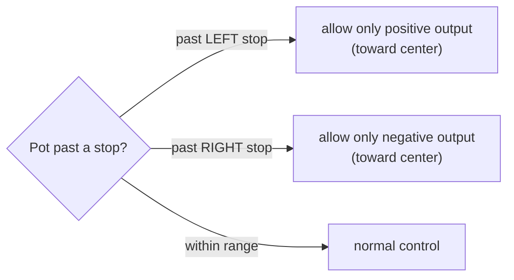
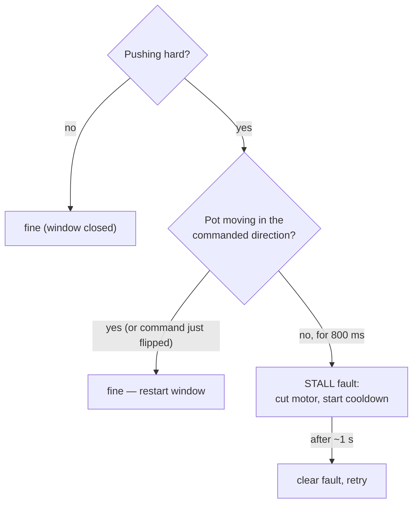

# Steering Safety & Faults

The Steervo protects **itself and the steering hardware** — especially the
feedback potentiometer, whose coupling can be torn off if the motor drives it past
a mechanical stop. This page describes every steering failsafe as it behaves in the
current firmware.

The guiding principle after recent hardening:

!!! abstract "Steering must never latch dead during driving"
    A steering fault that permanently cuts the motor is itself a hazard — the driver
    can no longer steer back to center. So the recoverable conditions
    (over-travel, stall, staleness) **self-clear**, while only a genuine sensor
    failure (pot range) stays latched. The pot is still fully protected.

## Fault / protection summary

| Condition | `STEER_STATUS` bit | Behavior |
|---|---|---|
| **Pot range** | `POT_RANGE` | Implausible ADC reading (rail / broken wiper). **Latched hard fault**, motor off — power-cycle to clear (a real sensor failure). |
| **Over-travel** | *(no longer reported)* | Pot driven past a calibrated stop. **Not a fault** — handled by the recovery clamp below. |
| **Stall / runaway** | `STALL` | Pot fails to follow a hard command (jam or wrong-way). Cuts the motor, then **self-clears** after a cooldown. |
| **Setpoint stale** | `SETPOINT_STALE` | No fresh `STEER_SET` for 150 ms. Motor off; **resumes** when frames return. |
| **Not calibrated** | `NOT_CALIBRATED` | No valid calibration. Run the calibration sequence. |
| **Talon lost** | `TALON_LOST` | Reported by the CAN transport on TX failure / bus-off. |

## Over-travel recovery clamp (non-latching)

If the pot reads **past a calibrated end stop**, the controller does **not** fault.
Instead, an output clamp permits motion **only toward center** while past a stop —
the motor can always drive itself back out, but can **never** be commanded deeper
into the rail:

Because the clamp uses the **measured position** (which pins at the stop angle),
it prevents deeper travel even if the loop sign were somehow wrong.

!!! note "Why this used to strand the steering"
    Over-travel was previously a **latched** hard fault triggered on a **single
    tick** past the stop. A momentary overshoot at full lock, a bit of oscillation,
    or pot noise would latch it and cut the motor — leaving the steering stuck at
    the edge, unable to return to center, until an ESP32 reset. Making it
    non-latching (the recovery clamp is the real protection) fixed that.

## Stall / runaway watchdog (pot-progress based, self-clearing)

While the motor **pushes hard**, the pot must actually **move in the commanded
direction**. Progress is measured on the **pot's motion**, not on the tracking
error — this is the key to making fast steering-wiggles safe:

- **Fast wheel wiggling** — the setpoint races back and forth, so the *error* never
  settles, but the pot **is** being driven correctly. Because progress is measured
  on the pot (which keeps moving toward each new target), a wiggle is **not** a
  stall. The window also restarts every time the command direction flips.
- **A genuine jam** (pot frozen under a hard push) or a **wrong-way runaway**
  (inverted feedback — pot moving *opposite* the command) fails to make pot
  progress and trips after ~0.8 s. A wrong-way runaway trips **mid-travel**, before
  a stop is reached — catching an inverted-feedback wiring error before it can
  stress the pot.
- The stall fault is **self-clearing**: after a ~1 s cooldown it drops and the loop
  retries. A transient (or a freed jam) recovers automatically; a persistent jam
  simply re-trips into a bounded on/off duty that protects the motor **without**
  ever leaving the steering dead.

!!! note "This fixed the reset-required lockup"
    Wiggling the input fast enough used to trip a latched `STALL` (`state=3`) that
    required hitting the ESP32 reset pin. The pot-progress metric removes the false
    trigger, and the self-clearing behavior guarantees a fault can never persist.

## Setpoint staleness

If the enabled `STEER_SET` stream stops for 150 ms, the Steervo de-energizes the
motor and sets `SETPOINT_STALE`. This is **recoverable** — it returns to READY and
resumes as soon as fresh frames arrive. (The Talon's own ~100 ms PWM-loss failsafe
also parks the motor if the Steervo itself stops.)

## Anti-lockout recentering

Because a stuck steering must always be recoverable, the Teensy offers a
**`STEER RECENTER`** command that drives the output to the **calibrated center
independent of the input wheel** — so the steering can be recovered even with the
wheel unplugged (e.g. right after a reflash de-enumerates the USB host). It is
bounded: it auto-stops once centered or after a timeout, and requires a healthy,
calibrated link. This is the **only** path that energizes the motor without a
connected wheel, and only toward the safe center.

## What stays latched, and why

Only **`POT_RANGE`** stays a latched hard fault requiring a power cycle. An
implausible pot reading (at the ADC rail, or a broken/disconnected wiper) means the
feedback can no longer be trusted at all — and without trustworthy feedback the
motor must **never** run. Everything else is designed to recover so the driver is
never left without steering.
