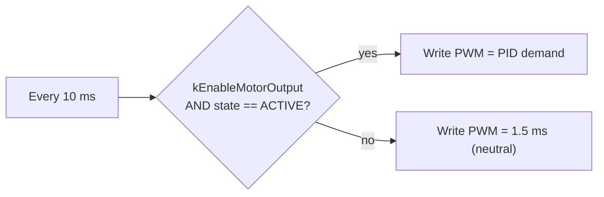

# Talon PWM Control

The Steervo drives the steering motor through a **Talon SRX** motor controller
using a **standard servo PWM signal** — the same kind of pulse a hobby servo or an
FRC PWM ESC expects. The Talon is deliberately **not** on the CAN bus.

## The signal

- **ESP32 GPIO15 → Talon SRX PWM signal input** (plus a common ground).
- A 50 Hz frame with a pulse width of:

| Pulse width | Command |
|---|---|
| **1.0 ms** | full reverse |
| **1.5 ms** | neutral (motor parked) |
| **2.0 ms** | full forward |

The controller's demand fraction (`−1…+1`) maps linearly onto ±500 µs around the
1.5 ms neutral. The pulse is generated by the ESP32's LEDC peripheral at 16-bit
duty resolution (~0.3 µs steps — far finer than the Talon resolves), refreshed at
100 Hz.

!!! note "The Talon must be in PWM mode"
    The Talon has to be configured for **PWM input with no CAN/RoboRIO owner**. If
    it was last used on an FRC robot, power it while holding its reset button until
    the LED blinks green to release the FRC lock, otherwise it ignores the PWM
    signal. Its endpoints are usually already calibrated to 1.0/2.0 ms from FRC use.

## The neutral-command failsafe

The design leans on a **free hardware failsafe**: the Talon **self-neutralizes if
PWM pulses stop** (after ~100 ms). So a crashed, reset, or unpowered Steervo parks
the steering motor on its own — no watchdog code required.

On top of that, the firmware **commands neutral (1.5 ms) whenever the controller is
not genuinely ACTIVE** — belt and braces:

So the motor only ever moves when **all** of these hold: the compile gate
`kEnableMotorOutput` is set, the runtime `STEER ON` enable bit is present, the link
is fresh, the pot is calibrated, and the controller has therefore reached its
ACTIVE state. Any of them missing → neutral PWM → no motion.

## Power

The Talon rides its **own always-on power rail**, independent of the traction-bus
precharge. So it initializes and stays ready on its own, and the steering path does
not depend on the contactor being closed.

!!! warning "Older docs say GPIO25 — the code uses GPIO15"
    The plan and CAN protocol notes reference "Steervo GPIO25" for the Talon PWM;
    the shipped firmware uses **GPIO15**. GPIO15 is authoritative. Confirm the
    physical wiring, and see [Hardware & Open Items](../hardware-open-items.md) for
    the Talon/CIM/gearbox specifics that live outside the repo.
